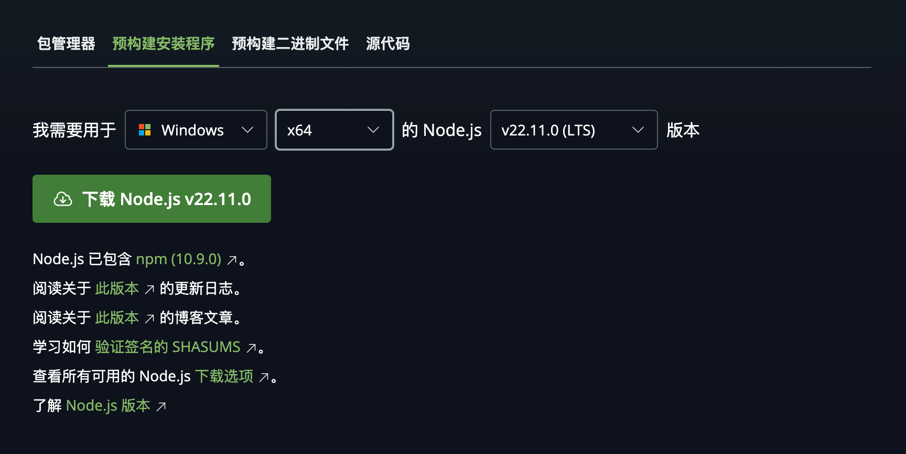

# Node.js

!!! quote 
    
    Node.js 是一个开源和跨平台的 JavaScript 运行时环境。它是几乎所有类型项目的流行工具！

    Node.js 在浏览器之外运行 V8 JavaScript 引擎（Google Chrome 的核心）。这使得 Node.js 的性能非常出色。
    
    --[NodeJS 简介](https://nodejs.org/zh-cn/learn/getting-started/introduction-to-nodejs)

介于你几乎不会在这个场景下写 JavaScript 代码，你只要知道你接下来使用的某些工具（例如 SillyTavern）需要安装这个才能运行就好。

## 安装 Node.JS

!!! info

    考虑到文档读者的受众、智力水平和阅读理解能力，这里会多“关照” Windows 一点。
    如果你已经是个熟练的 macOS / GNU/Linux 用户，那么聪明的你应该自己就能搞定。🙂

    [Node.js 提供了如何在各个操作系统上通过包管理器安装的文档。](https://nodejs.org/zh-cn/download/package-manager/all)

### Windows 

!!! failure "警惕国产搜索引擎诈骗"

    Node.js 是可以免费获取的，自由的开放源代码软件。
    如果你因为下载这个付了钱（不含可能产生的电费和流量费），那么恭喜你被骗了。 🙃


打开下载 Node.js 预构建安装程序的页面： 
[https://nodejs.org/zh-cn/download/prebuilt-installer](https://nodejs.org/zh-cn/download/prebuilt-installer)



* 第一个选项选择你的操作系统。
* 第二个选项选择你的电脑 CPU 的体系结构，除非你家境殷实用了搭载骁龙处理器的 Windows 电脑（那你选”ARM64“），否则都该选”x64“。
* 第三个选项选择你要下载的 Node.js 版本，大多数情况下，你都应该选择最靠上的 LTS 版本。

至于安装器，虽然界面都是英文，但你可以一路 Next 的点下去。

## Termux

你需要的只是运行一行命令：

```bash
$ pkg install nodejs-lts
```

## 配置 Node.js 使用其它 NPM 存储库

事情并不会总是一帆风顺，因为还是那堵伟大光荣正确的防火墙在给你添堵 🙃

如果你在运行 `npm` 命令时遇到了任何的网络错误，你可以尝试为 npm 设置替代存储库位置。
例如淘宝的 `npmmirror`。

``` bash
$ npm config set registry https://registry.npmmirror.com
```