# Termux 

!!! quote 

    Termux is an Android terminal emulator and Linux environment app that works directly with no rooting or setup required. 
    A minimal base system is installed automatically - additional packages are available using the APT package manager

    Termux 是一款 Android 上的终端模拟器和 Linux 环境应用程序，无需 root 权限即可运行。通过 apt 软件包管理器可以下载更多软件

    -- https://termux.dev/en/

通过 Termux，一些支持远端计算或 API 调用的软件可以在手机上运行。（例如 SillyTavern）

!!! warning

    看到这个描述就知道 iOS/iPadOS/HarmonyOS NEXT 是用不了的。

!!! info

    Termux 文档目前位于 [https://wiki.termux.com/wiki/Main_Page](https://wiki.termux.com/wiki/Main_Page) ，[正在计划迁移回主站](https://termux.dev/en/docs/index.html) 

## 使用建议

!!! quote

    翻译自 https://wiki.termux.com/wiki/Getting_started 。

* 学习 shell 脚本！

    你不一定需要十分精通，但至少需要知道自己在做什么，以及你获得的各种脚本会做什么。

* 始终保持软件包最新！
    
    定期运行`pkg upgrade` 命令，或至少在安装新软件包之前运行命令。
    不更新软件包或降级软件包有可能会导致问题。

* 一定要备份！
    
    因为 Termux 不提供旧版本的软件包，并且它是一个滚动发布版本。所以如果没有备份，如果出现问题，您可能无法回滚。

* 不要执行你不知道的脚本和命令！

    查看从互联网上下载的脚本。仔细检查你在终端中输入的内容。

* 仔细阅读打印到终端的所有内容！
    
    理解信息消息有助于解决可能发生的问题。

## 下载

!!! warning 不建议从 Google Play 商店安装 Termux

    Termux 的 Play 商店版本不再更新许久，最近重新开始更新的版本为了通过 Google Play 商店的审核而删除了部分功能，因此建议通过下述的 GitHub 或 F-Droid 安装。

* 下载 F-Droid:：https://f-droid.org/
* 下载 Termux：https://f-droid.org/zh_Hans/packages/com.termux/

!!! tips "Termux 的一些可选组件"

    除了本体 App 以外，Termux 支持通过一些可选 App ，扩展出一些额外功能。

    * Termux Styling: https://f-droid.org/zh_Hans/packages/com.termux.styling
        
        更改 Termux 终端的背景和字体。

    * Termux:Float：https://f-droid.org/zh_Hans/packages/com.termux.window/
        
        在浮动终端窗口中使用 Termux

    * Termux:Widget：https://f-droid.org/zh_Hans/packages/com.termux.widget
        
        增加可以从主屏幕启动 Termux 命令的快捷方式或桌面小组件。

    * Termux:API：https://f-droid.org/zh_Hans/packages/com.termux.api/
        
        从 Termux 访问 Android 功能，例如共享存储空间和剪贴板。

    * Termux:Boot：https://f-droid.org/zh_Hans/packages/com.termux.boot/
        
        允许在手机开机时自动运行一些 Termux 中的命令。

!!! warning

    在正常的 Android 系统上，你只要授予 F-Droid 或者浏览器“安装未知应用”权限，然后就可以顺利的完成安装。

    请自行解决各种国产“OS”中想尽一切办法阻止你安装你自己下载来的软件的问题。


## 第一次启动

你第一次启动 Termux 的画面大约就是这个样子。

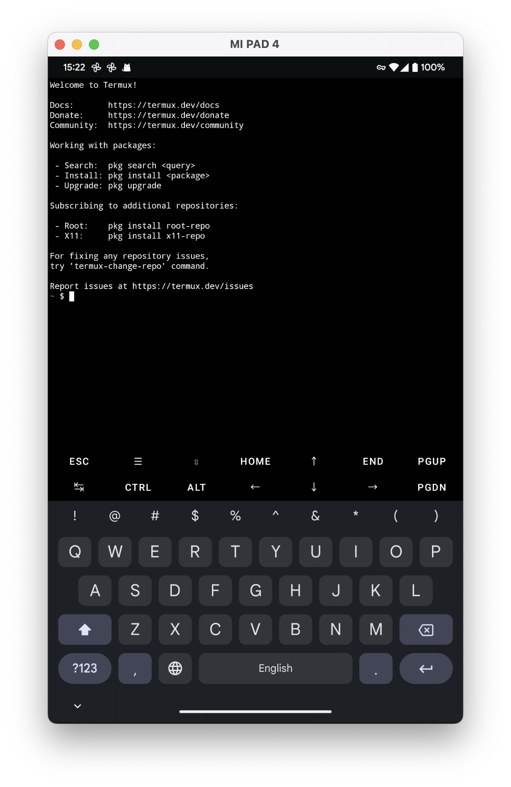

* 输入法键盘上方的按键提供了许多实用的功能。例如光标，以及电脑上常见的 Ctrl 和 Alt 键。
* 如果觉得字体大小太大或是太小，可以双指缩放进行调整。
* 从左边滑动可以打开会话列表。

    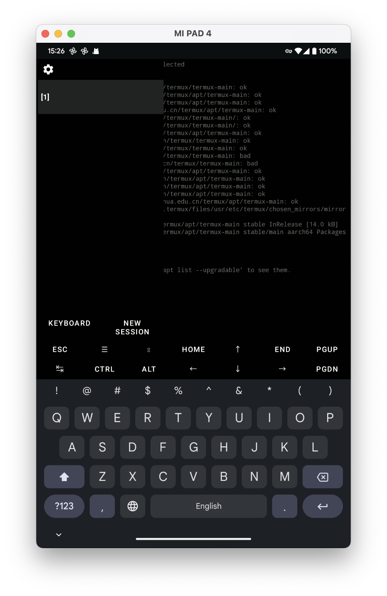

    * 点击“KEYBOARD”可以展开或隐藏输入法的虚拟键盘。
    * 点击“NEW SESSION”可以打开一个新的会话窗口，在你需要同时运行多个程序时（例如 Clewd 和 SillyTavern）会很有用。
   
### 更换镜像仓库

!!! tips

    使用合适的镜像仓库（例如链接速度最快的），可以有效缩短你安装软件或升级时的等待时间。

    特别是 Termux 默认的仓库在墙国连接不佳的情况下。

!!! info

    你打了这么多字，总该知道 Enter/回车/换行 说的是同一个键，而且你也知道是哪个了吧？

    后面就统一叫 Enter 了。

输入 `termux-change-repo` 然后按 Enter 运行。

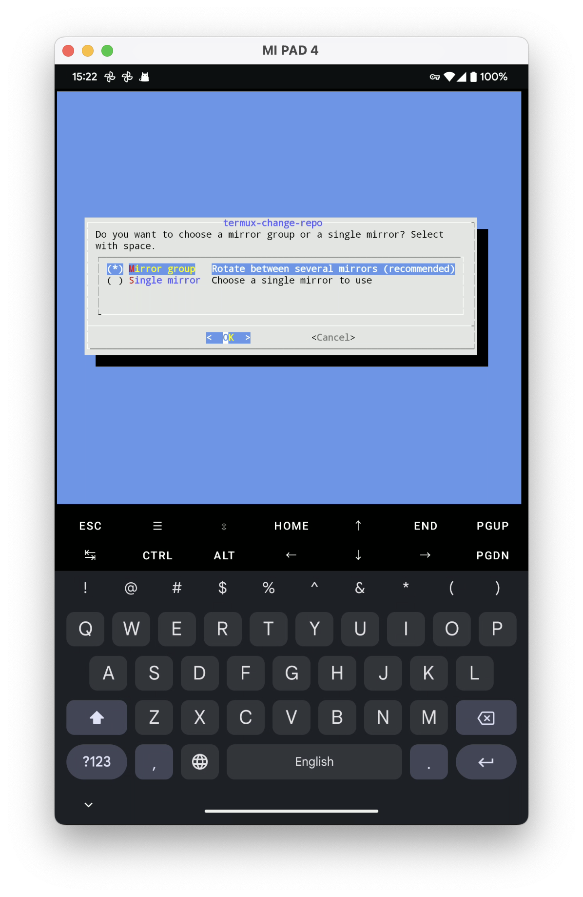

因为选择一组镜像仓库，可以在一个仓库连接失败时尝试另一个，所以这里直接进入下一步。


选择镜像仓库组的位置，这里把光标指向距离你最近的位置，例如 China Mainland，然后按空格键选择这个选项。
一个选项被选中时，前面会有一个星号（*）。

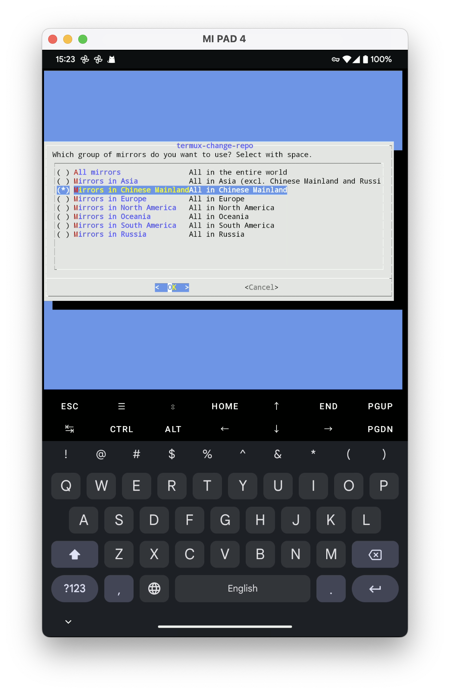

按 Enter 确认，Termux 会自动测试连接到各个镜像站的速度，然后选择最快的一个。

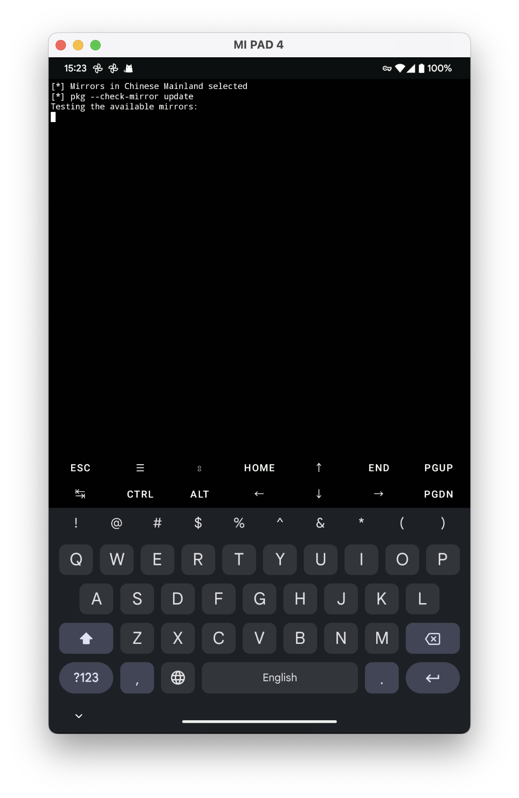

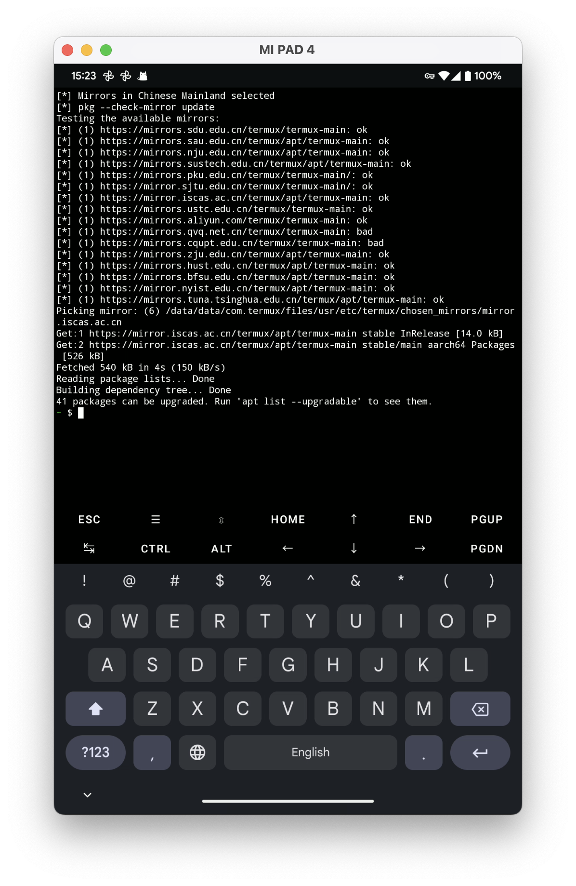

### 更新环境

首先运行 `pkg update` ，它会更新设备上缓存的软件仓库中软件的列表，然后报告是否有软件需要更新。


这里 `41 packages can be upgraded. Run 'apt list --upgradable' to see them. ` 
就表示有 41 个软件包可以更新？

!!! tips "那为什么里面叫做 apt ？"

    因为 Termux 使用的包管理器其实就是 apt。

    如果你熟悉 apt 的使用（例如你是个 Debian/Ubuntu 用户），你也可以像以往一样使用你熟悉的 apt 命令。

接下来运行 `pkg upgrade`。

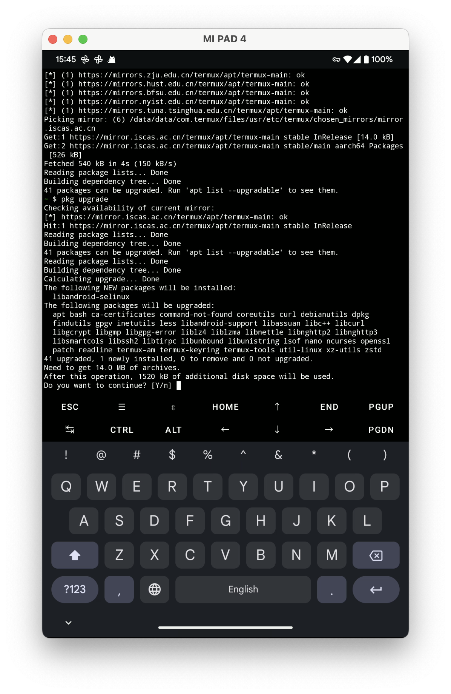

会提示你哪些软件需要升级，会下载多少数据。你可以输入 Enter 继续下一步。

!!! tips "问题中的 `[Y/n]` 表示什么？"

    大写的字母用来表示当你直接按下 Enter 时会做出什么选择，例如在这里就是确认。

    某些破坏性操作的默认值可能是取消，这个时候你往往会遇到类似 `[y/N]` 的提示。
    如果你想继续，那么就输入一个字母`y`，然后按Enter键确认。

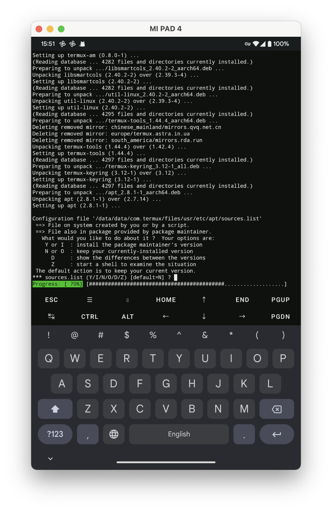

在第一次升级的时候，你也许会遇到这样的问题，提示你文件可能存在冲突。

```bash
   What would you like to do about it ?  Your options are:
   # Y/I: 安装新文件，覆盖现有文件
    Y or I  : install the package maintainer's version
   # N/O：保持现有文件
    N or O  : keep your currently-installed version
   # D：用 diff 工具展示文件间的差异。
   # Z：打开一个新的 Shell，用于测试变更。
   # 这两个选项如果你不知道是在做什么，那你就用不上。
      D     : show the differences between the versions
      Z     : start a shell to examine the situation
# 默认选项是抱持现有文件不变。
 The default action is to keep your current version.
*** sources.list (Y/I/N/O/D/Z) [default=N] ?
```

因为第一次升级时，我们确信没有修改过哪些文件，所以你可以输入 `y` 或者 `i` 确认覆盖。

!!! warning "如果你第一次升级之后再遇上这种问题，请格外小心"

    之后就不能无脑的确认覆盖了，除非你确信你没有修改过冲突的文件。


!!! info

    升级之后你的镜像仓库设置可能会被还原成默认设置。建议再按照上面的步骤运行一次设置镜像仓库的命令。

## 安装软件

一行命令就足够了，以安装 Node.js 为例。

```bash
~ $ pkg in nodejs-lts
Checking availability of current mirror:
[*] https://mirrors.tuna.tsinghua.edu.cn/termux/apt/termux-main: ok
Reading package lists... Done
Building dependency tree... Done
Reading state information... Done
The following additional packages will be installed:
  c-ares libicu
Suggested packages:
  clang make pkg-config python
The following NEW packages will be installed:
  c-ares libicu nodejs-lts
0 upgraded, 3 newly installed, 0 to remove and 0 not upgraded.
Need to get 19.5 MB of archives.
After this operation, 101 MB of additional disk space will be used.
Do you want to continue? [Y/n]
```
安装软件时的确认和升级时一样，你在运行某些未找到的命令的时候，也会有机率提醒你要安装哪些软件。

```bash
~ $ node
The program node is not installed. Install it by executing:
 pkg install nodejs
or
 pkg install nodejs-lts
```

!!! quote

    Termux 的文档有对 `pkg` 命令用法的更多详细介绍。

    https://wiki.termux.com/wiki/Package_Management

## 保持 Termux 后台运行

!!! warning

    在大多数国产品牌的”OS“上，仅仅这么做还不够。

    但此文档无法涉及所有品牌的所有状况，请自行查找如何在你的手机上保持应用后台运行的方法。

    这一部分只会提示你如何为 Termux 关闭 Android 自带的”电池优化“功能。


下拉通知栏，点击 Termux 通知中的 "Acquire wakeclock"。

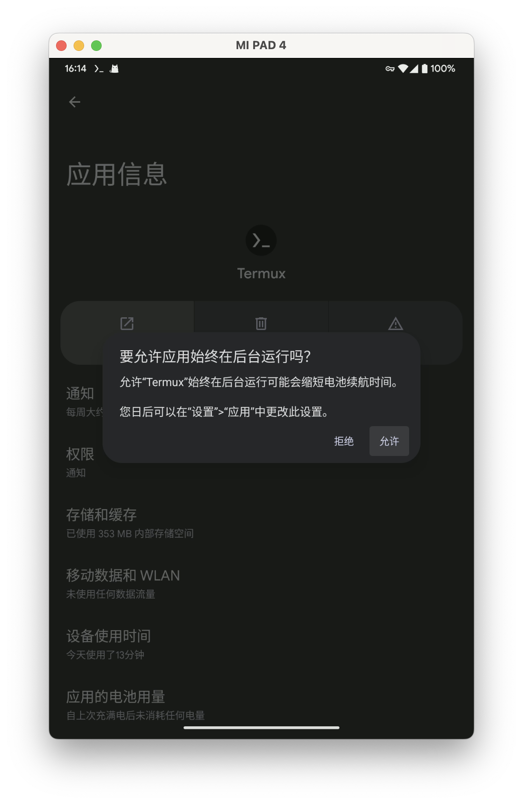 

拉回通知栏，允许 Termux 在后台运行。

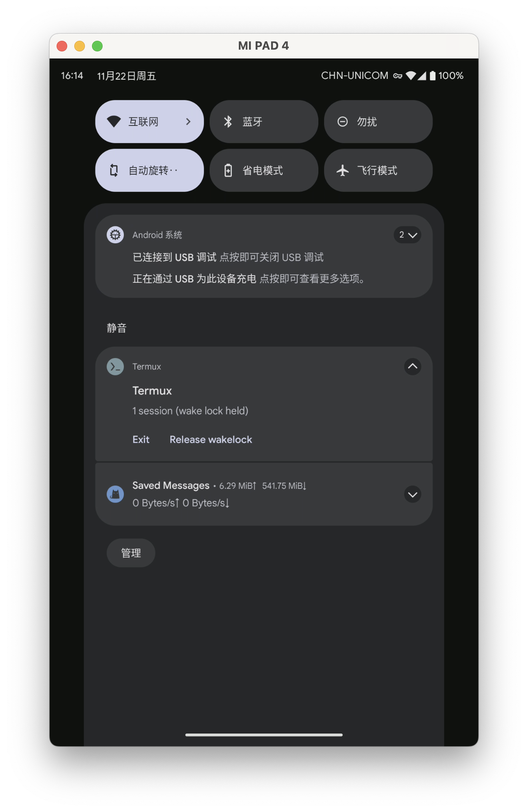

之后你可以点击 "Release Wakeclock" 取消常驻，在 Termux 退出时，这个状态也会自动重置。

## 查看 Termux 数据

支持 DocumentProvider 的文件管理器可以查看 Termux 文件，这里推荐[质感文件](https://f-droid.org/zh_Hans/packages/me.zhanghai.android.files/)。

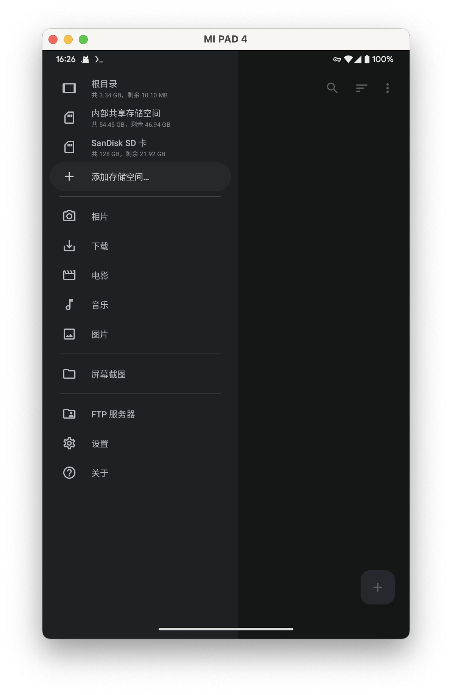
打开质感文件的菜单，选择”添加存储空间“。
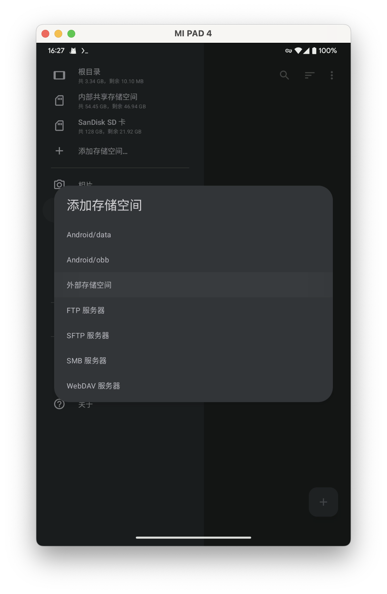
选择”外部存储空间“。
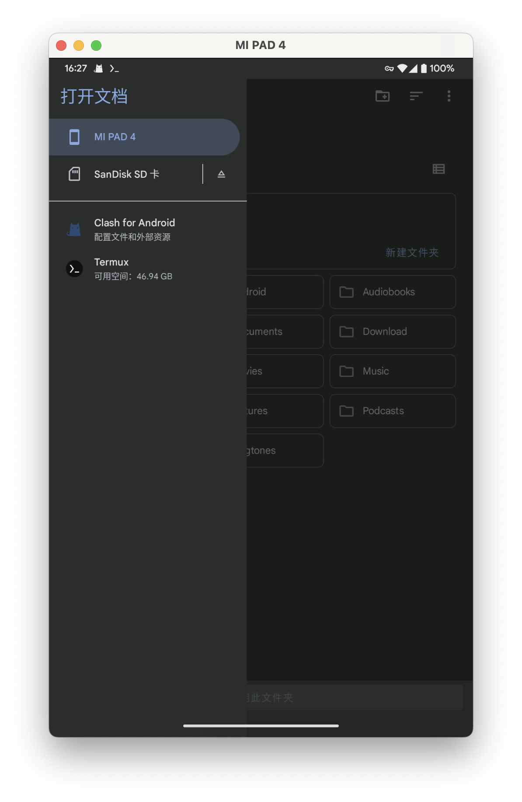
在打开的文档选择器窗口中，拉出左边的菜单，选择 ”Termux“。
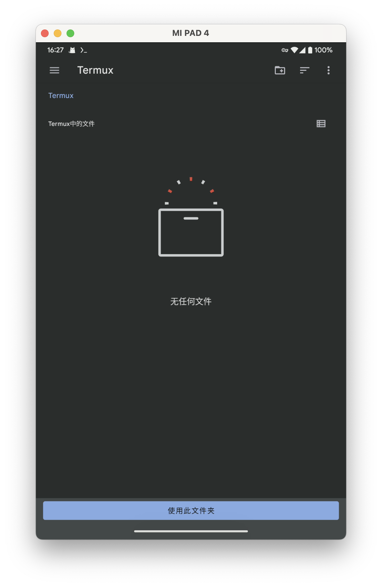
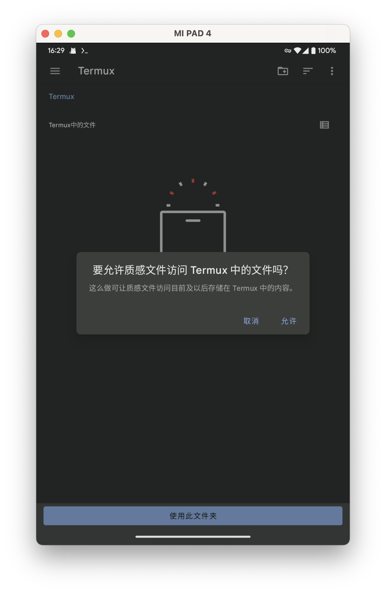
选择底部的”使用此文件夹“，并确认。
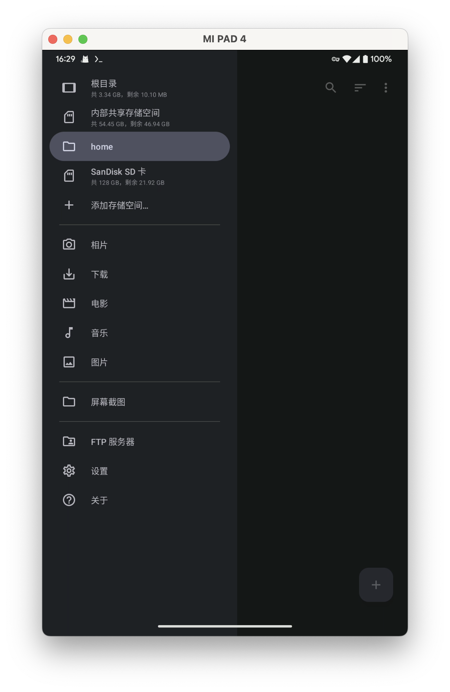
菜单中新增的”home“就是 Termux 的主目录。

## 备份和还原 Termux Prefix 数据

!!! info

    为了让 Termux 访问的手机的共享存储空间，首先要安装 Termux:API 。

    除此以外，termux-backup 命令**并不会**备份 Termux 主目录的数据。

假如你之前没有在 Termux 中访问设备的共享存储空间，那么先运行 `termux-setup-storage` 然后为 Termux 授予所有文件访问权限。
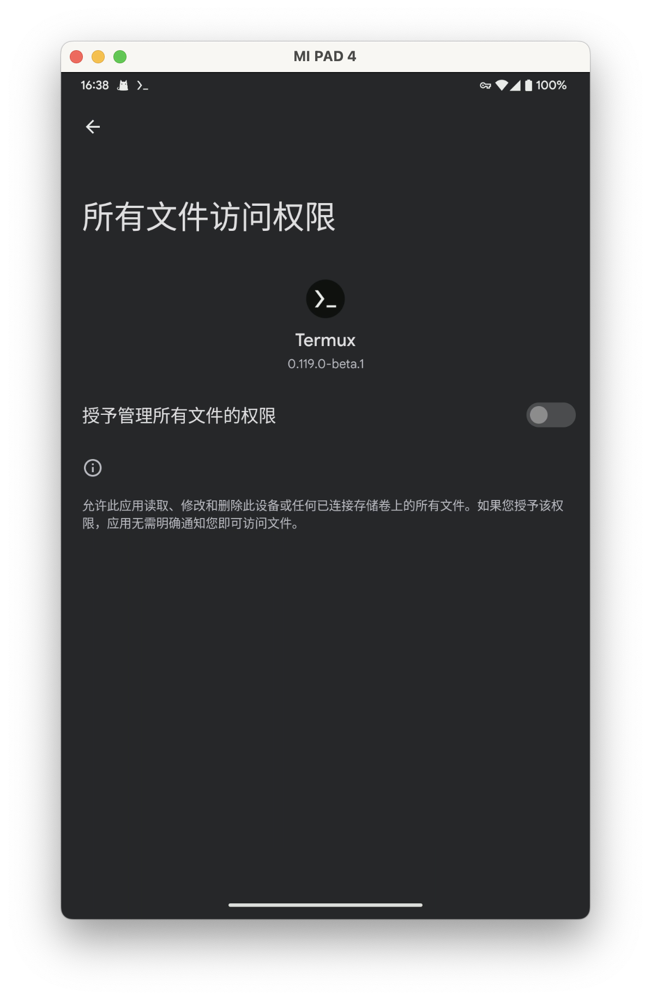

接下来，你就能在 Termux 的主目录里看到 `storage` 目录，里面是共享存储空间的符号链接。
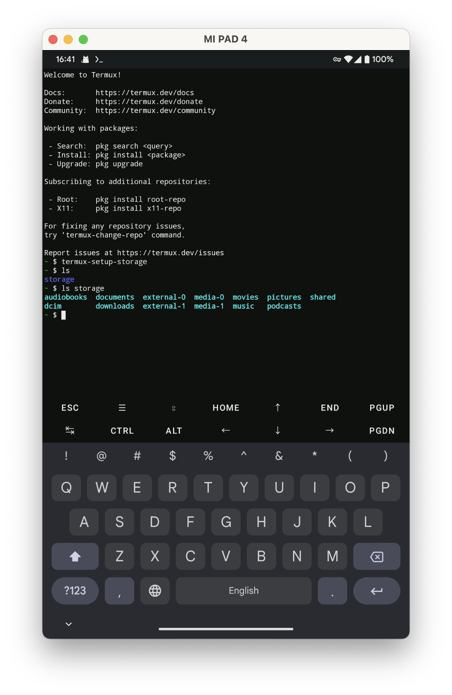

!!! info

    但是，Android 的共享存储空间（以及外部存储设备）不支持可执行权限，因此不要把可执行文件（例如脚本）放在那些地方。

运行 `termux-backup` 命令可以备份整个 Termux 目录中的内容。

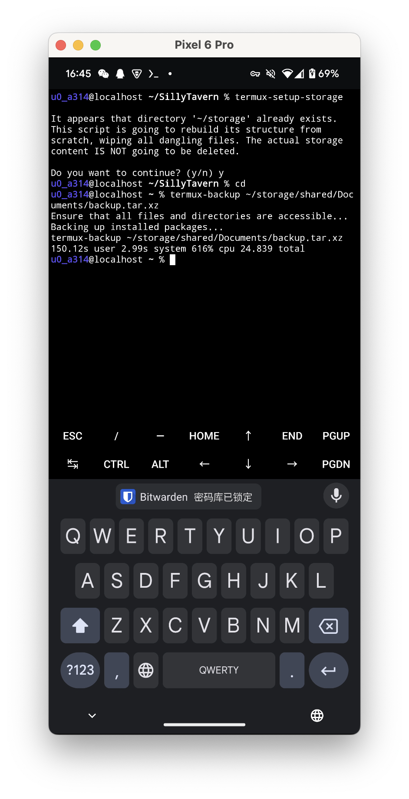

```bash
# termux-backup <备份的路径>
$ termux-backup ~/storage/shared/Documents/backup.tar.xz
```

待到运行完毕之后，可以在文件管理器中看到备份的文件，

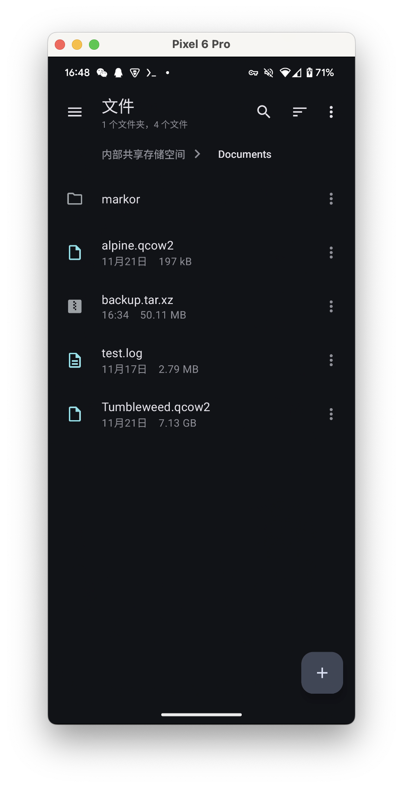

运行 `termux-restore` 命令可以从备份还原。

!!! warning

    你 Termux 当前的**所有**数据都将被备份中的内容覆盖。

## 备份和还原 Termux 主目录（home）数据