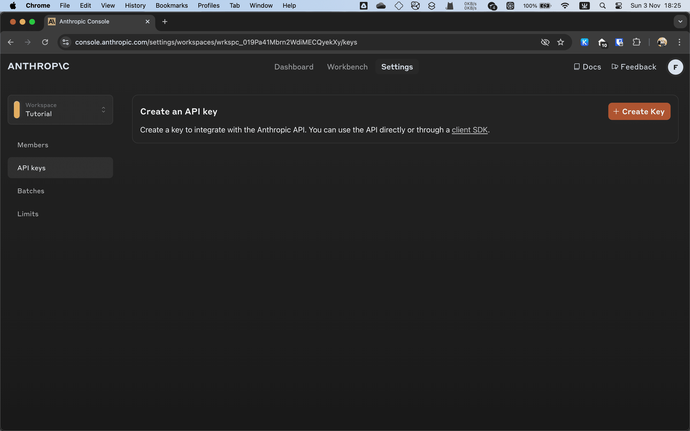
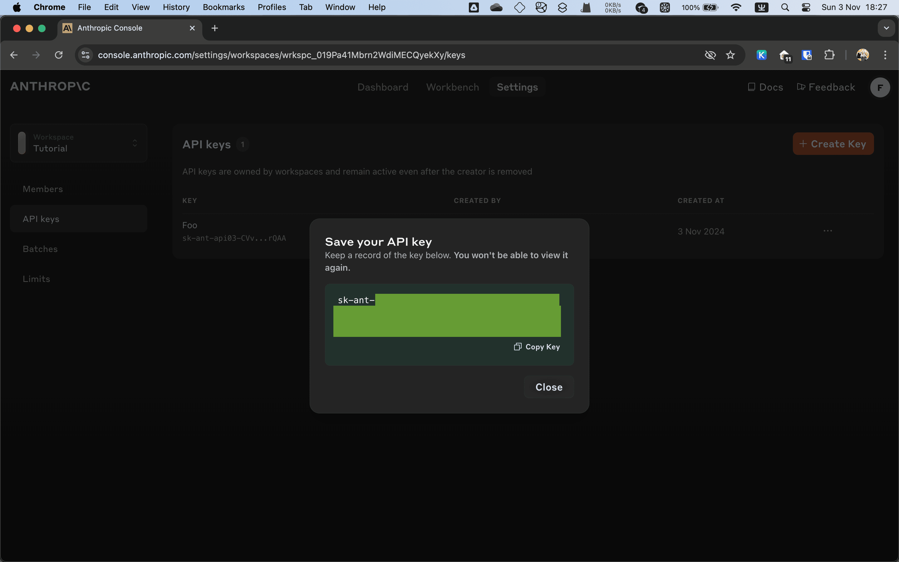

# Anthropic Console

获取 API 页面在这里： https://console.anthropic.com/settings/keys

点击 “Create Key” 按钮。

在点击 Add 确认之前，可以为 API 去一个名字，例如在哪里用的。

在下一个页面，点击 Copy Key 把生成的 API 密钥复制下来。

!!! warning "你只有这一次复制这个 API 密钥的机会"

    当点击 Close 关闭对话框之后，你就无法再查看这个 API 密钥的值了，只能禁用或删除之后重新生成一个。

日后如果你不再使用，或是不小心泄露了密钥，你可以通过 Disable（禁用）或 Delete（删除）这个 API 密钥。

区别在于禁用之后可以重新启用，但删除之后只能重新生成。