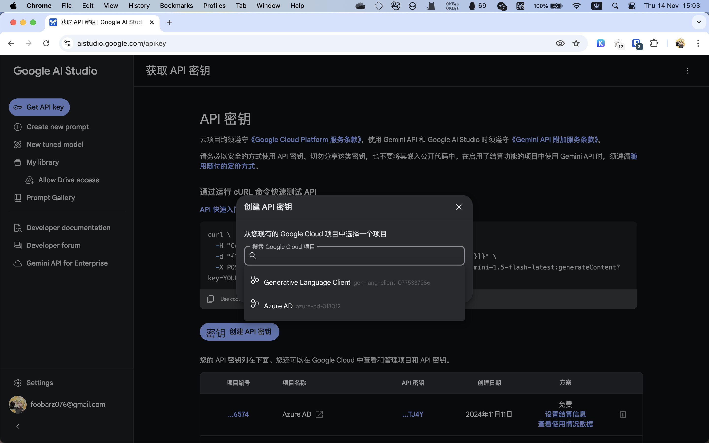

# 通过 Google AI Studio 取得 Gemini API 密钥

!!! tips "Google AI Studio 和 Vertex AI 并不一样"

    主要的区别就是 Google AI Studio 在大部分 Gemini API 支持的区域提供免费额度，
    而依托于 Google Cloud 的 Vertex AI 并没有。

    但你只是想用 Gemini API 的话，用 Google AI Studio 就行了。

## 取得 API 密钥

取得 API 密钥的页面位于 https://aistudio.google.com/apikey 。

点击”创建 API 密钥“按钮。

选择一个已有的 Google Cloud 项目，或是在这里创建一个项目。

在下一个窗口中把生成的密钥复制下来。

日后你可以点击密钥列表来再次复制 API 密钥的值，或是删除密钥。