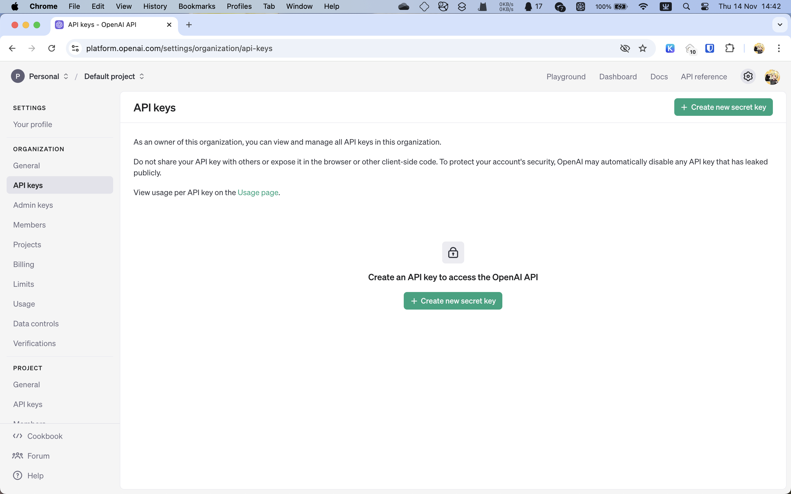
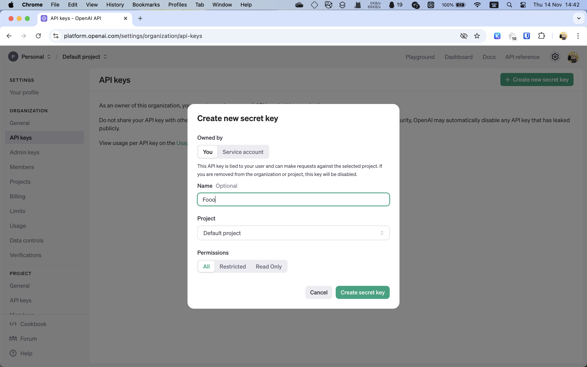
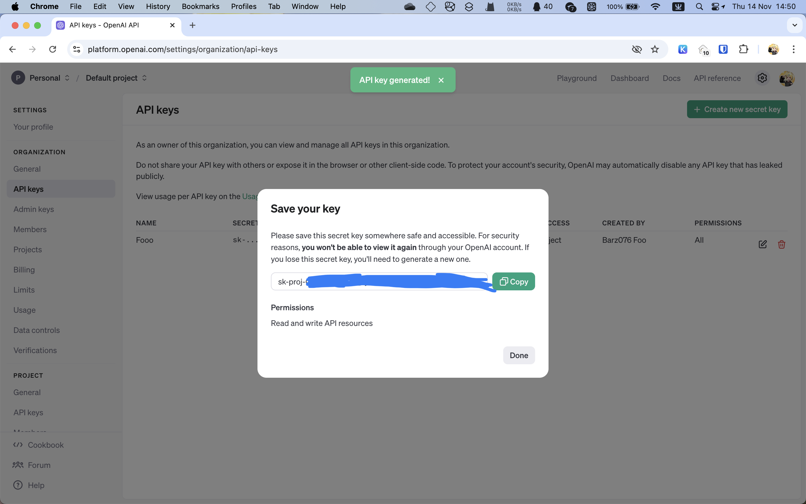

# OpenAI Platform

> OpenAI Platform : https://platform.openai.com/docs/overview

## 取得 API 密钥

界面位于 https://platform.openai.com/settings/organization/api-keys 。

点击左上角的“Create new secret key“ 按钮。

* Owned by （所有者）选择”You“（你）。
* 在”Name“里可以为你的密钥起一个名字，可以用来区分用途。
* 在”Project“里选择这个密钥归属的项目，假如你没有创建项目，那么就只有一个 Default Project。
* ”Permissions“（权限）用于指定此 API 密钥的权限范围，如果你搞不懂那些具体部分的含义，那就选择默认的 All。

接下来的 ”Save your key“ 窗口会显示你新建的 API 密钥的值，点击绿色的 Copy 按钮复制下来。

!!! warning "你只有这一次复制这个 API 密钥的机会"

    当点击 Done 关闭对话框之后，你就无法再查看这个 API 密钥的值了，只能禁用或删除之后重新生成一个。