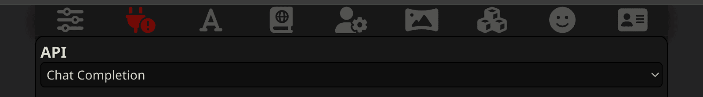
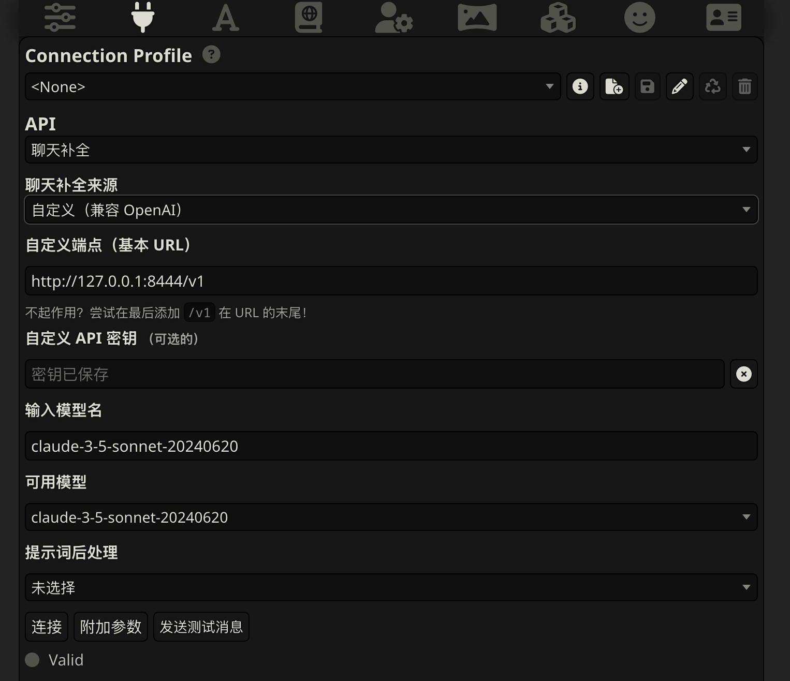
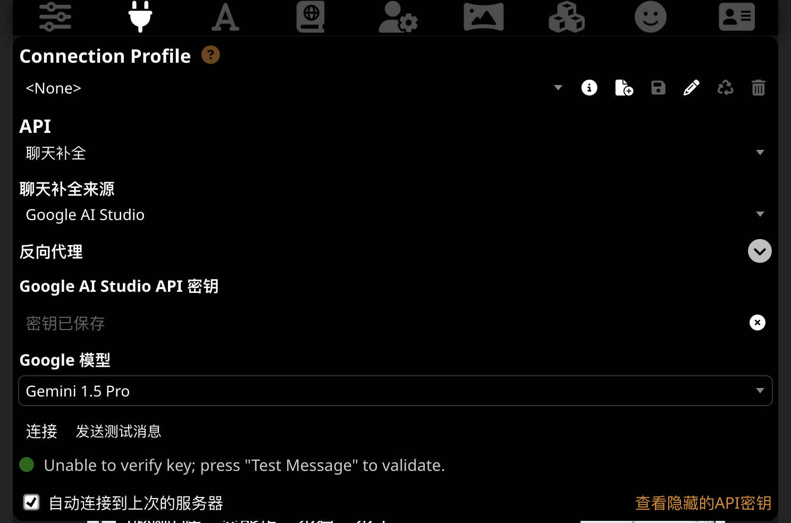

# 连接到 LLM
SillyTavern 可以与两种类型的 AI 交互：

## 免费或付费的 Web 服务
例如 OpenAI、Claude 和 Gemini。

付费网络模型是黑匣子。您向公司付费以使用其 AI 服务。您将您的帐户信息输入 SillyTavern，它会连接到您的提供商以代表您使用 AI。

优点：

* 真的很容易上手。
* 假如能够成功输出，内容的质量通常都很好。

缺点：

* 大多数服务是付费的。
* 所有内容都记录在他们的服务器上。这也许会是个隐私问题。
* 他们经常受到审查并会拒绝与您聊某些话题。

!!! warning 

    在使用付费网络模型时，以下的行为有机率让你被服务提供商封禁：

    * 通过对话补全预设，世界书等方式绕过 LLM 模型或服务的安全机制的行为（有时会被称作“越狱”）。
    * 生成不符合他们的可接受使用政策的内容，例如色情和血腥暴力内容。

!!! important

    在继续之前，请确保你已经取得了对应平台的 API 密钥，或设置好了相应的工具。

    除此之外，除非另外说明，这部分中 SillyTavern API 连接的菜单中选择的 API 类型都是 ”Chat Completion“ （聊天补全）

    

!!! failure "此文档不会涉及非官方途径的连接"

    再次重复，**此文档不会涉及官方途径或需要官方途径取得的登录凭据（Cookie或API密钥等）以外的连接方式。**

    如果你不是通过官方途径使用的 API 且遇到了问题，请询问卖给你服务的人，**而不是 ST 开发者或此文档维护者。**
    
    在 SillyTavern 官方 Discord 服务器提及非官方途径以外的反向代理和中转会导致你被封禁。

### ChatGPT （OpenAI Platform） 

!!! warning "仅适用于 OpenAI Platform"

    Azure OpenAI Service 的密钥并不能在这里使用。你也许需要使用 oai-reverse-proxy 或是 one-api 之类的中间层工具转换为兼容 OpenAI API 的格式。

* 聊天补全来源选择 ”OpenAI“。
* 将你获得的 API 密钥填入”OpenAI API 密钥“内。

### Claude （Anthropic Console） 

!!! warning "仅适用于 Anthropic Console"

    Google Vertex AI 和 Amazon Bedrock 的密钥并不能在这里使用。你也许需要使用 oai-reverse-proxy 或是 one-api 之类的中间层工具转换为兼容 OpenAI API 的格式。

    除此以外 Clewd 不是在这里用。Slack和Poe的Cookie在这里也不起作用。

* 聊天补全来源选择 ”Claude“。
* 将你获得的 API 密钥填入 "Claude API 密钥“内。

### Claude （clewd） 

!!! warning "你现在并不需要通过 Clewd 连接 Claude API"

    Clewd 虽然支持 API 模式，但你通常**不需要这样用**。

* 聊天补全来源选择 ”自定义（兼容 OpenAI）“。
* 自定义端点（基本 URL）填入你 clewd 的地址，例如 `http://127.0.0.1:8444/v1` 。
* 如果你因为各种原因要使用 Clewd 的 API 模式， 将你获得的 Claude API 密钥填入 "自定义 API 密钥“内。

### Google Gemini

!!! tips "仅适用于 Google AI Studio"

    Google Vertex AI 的服务账户和 API 密钥并不能在这里使用。但你只为了用 Gemini 模型的话，似乎也不需要用 Vertex AI。

* 聊天补全来源选择 ”Google AI Studio“ 或 ”Google Makersuite“ （如果你没更新酒馆）。
* 将你获得的 API 密钥填入”Google AI Studio API 密钥“内。

## 自行托管运行模型
自托管模型是可以在您的 PC 上运行的免费模型，但需要功能强大的 PC 和更多的工作来设置。

优点：

* 一旦设置完毕，即使没有互联网接入也可以免费使用。
* 完全隐私。您写的所有内容都保留在您自己的电脑上。
* 模型种类繁多。作为一项社区驱动的技术，您可以找到适合您所需特定任务或行为的模型。

缺点：

* 它们不如商业服务提供的模型那么强大（即，它们编写的对话更差，创造力更差，等等）。
* 运行本地模型需要至少具有 6GB VRAM 的 GPU。

!!! info

    因为文档作者财力不足，暂时没有和本地运行模型相关的建议。