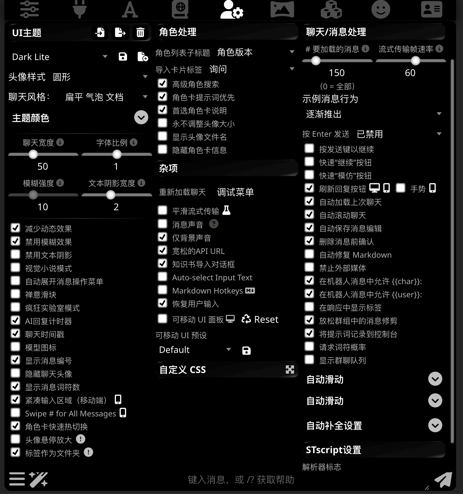
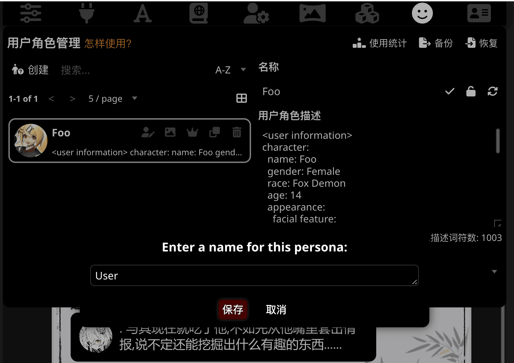
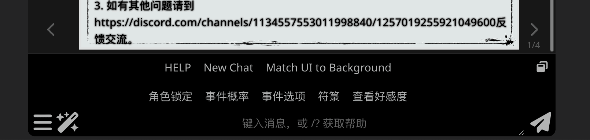

# 准备和开始聊天

## 调整上下文/格式化设置

高级格式化设置是第三个按钮。（那个像个字母 A 那个）

!!! info "其实高级上下文设置中的绝大多数功能都用不上"

    不然它为啥叫”高级上下文设置“ （笑）

    不开玩笑的说法是，上下文模板，提示模板（Instruct Template）和系统提示词对聊天补全 API 
    （你用的 Claude、GPT 或 Gemini 这些都是聊天补全 API）不起作用。

### 上下文格式

!!! info 

    因为文档作者自己也没仔细研究过这些选项的作用，需要更多知道这些选项是什么的人来解释一下。

推荐的选项是开启”折叠空格“，关闭”修剪不完整的句子“。其它的保持默认即可。

### 自定义停止字符串

以 JSON 数组格式的一组字符串，当输出包含这些字符串中之一时便会停止输出。

但你首先应该考虑的是如何不让 AI 输出被截断是吧？

### 词符化器

用于在各种地方计算消息的词符数。

默认的 Best-match 就很合适，或者你确定你在用什么模型的时候，也可以设置成相应模型的选项。

## 调整用户设置

!!! tips "似曾相识，对吧？"

    你应该已经在之前切换高级用户界面和启用外部媒体的时候就用过这个菜单了。

和上下文设置一样，假如你不知道那个选项的作用，大多数的情况下保持默认就好。
除非你下载的角色卡的作者要求你打开或关闭某个选项。（例如前几页中演示的角色卡如果开启了“自动修复 Markdown
选项就会出问题，所以要关掉。）

## 建立和使用用户角色

!!! tips 

    建立用户角色（Persona）这一步其实是可选的，部分角色卡中也可能在世界书中已经内置了一段用户角色设定。

    但假如你想跳脱作者的设定铃起炉灶的时候，用户角色可以帮助你（和AI）稳定设定，而无需在每一次对话中强调你的人设。

那个看起来像个笑脸的就是用户角色管理菜单。

要新建一个用户角色，点击那个”新建“按钮，然后为你的用户角色起一个名字。

点击一个用户角色可以在用户角色间切换（但之前已经发送的消息对应的用户角色不会改变），除此以外，那一排五个按钮的作用分别是：

* 将用户名称绑定到头像：其实就是重命名。
* 更改用户角色头像：换张大头照。
* 设置为默认角色：新的聊天会用你设置的默认角色作为用户角色。
* 复制和删除就不用介绍了吧？

然后，在旁边的”用户角色描述“框内输入你对你的人设的描述。

!!! tips 

    和角色卡一样，没有一个放之四海而皆准的标准规定用户角色描述该怎么写。

    你可以真的像占位符的例子中一样用简单的文字描述 {--（你真的是28岁的罗马尼亚猫娘？）--} ，
    也可以像角色卡的样式一样描述自己（然后就成了一张新卡是吧，{--兄弟别草我--}）。

    是时候发挥你无限的想象力了！

而右面除了保存新的用户名的对勾按钮以外，还有两个按钮分别是：

* 锁定角色：可以将一个选定的角色锁定到当前打开的聊天中。如果当前选定的角色与锁定的角色不同，则打开该聊天时将自动选择该角色。
* 同步角色：将当前打开的聊天中的所有用户发送的消息归因于当前选定的角色。

!!! tips "和角色管理有关的其它提示"

    * 在聊天中切换用户角色不会自动更改之前发送的用户消息的归属。这样就可以同时使用多个用户角色。
    * 要更改角色图像而不删除它，请将鼠标悬停在角色管理面板上的头像上，然后单击左下角的按钮。然后选择一张新图像，它将被替换，同时保留您设置的描述和聊天锁定状态。
    * 要在聊天中快速更改角色而不打开角色管理面板，可以使用 /persona 斜线命令。例如，/persona Blaze。
    * 您可以备份您的用户角色，并在需要时使用之前保存的文件恢复它们。在用户角色管理菜单中查找“备份”和“恢复”按钮。

## 第一条消息

第一条消息描述了角色将如何以及以何种风格进行交流。所以一般都会很长。

有些角色卡可能会包含多个第一条消息，例如划分不同的开场，或是在第一页放置一些信息。这个时候可以通过下方的箭头在不同的消息中切换。

## 第一条用户消息

该你写了（笑），写完按旁边的发送按钮，或者键盘上的 Enter 键就行了。

<!--

## 菜单中的其它功能

## 扩展功能

-->