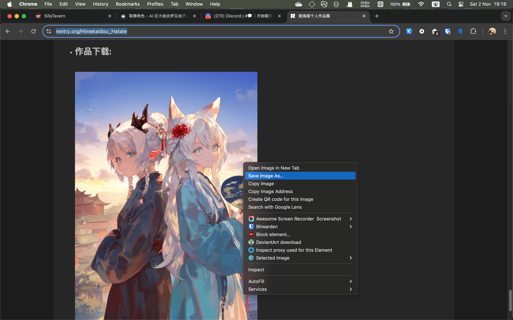
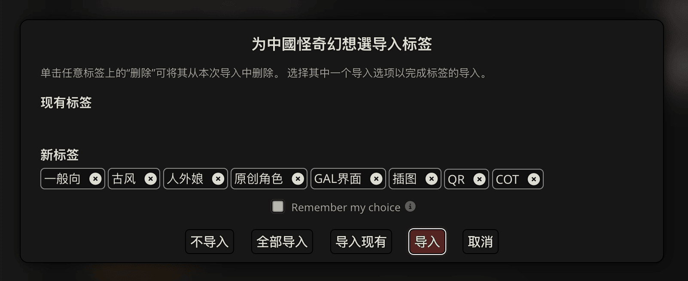
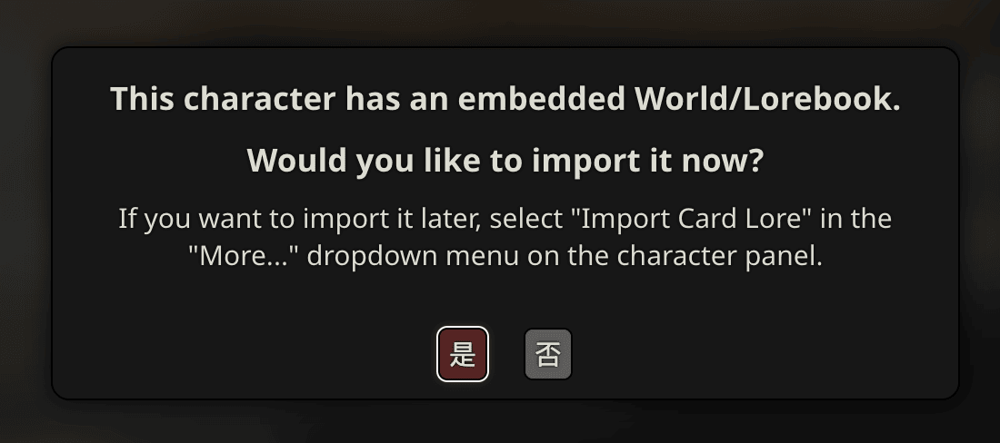
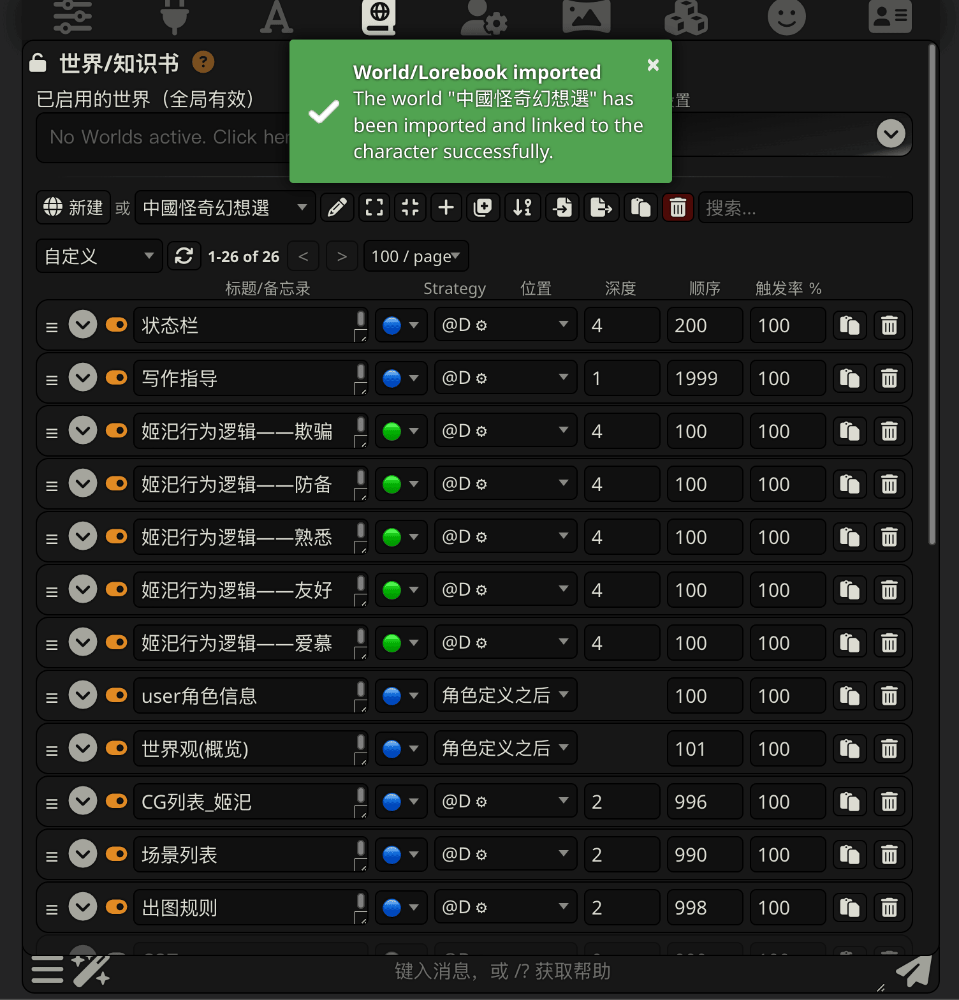
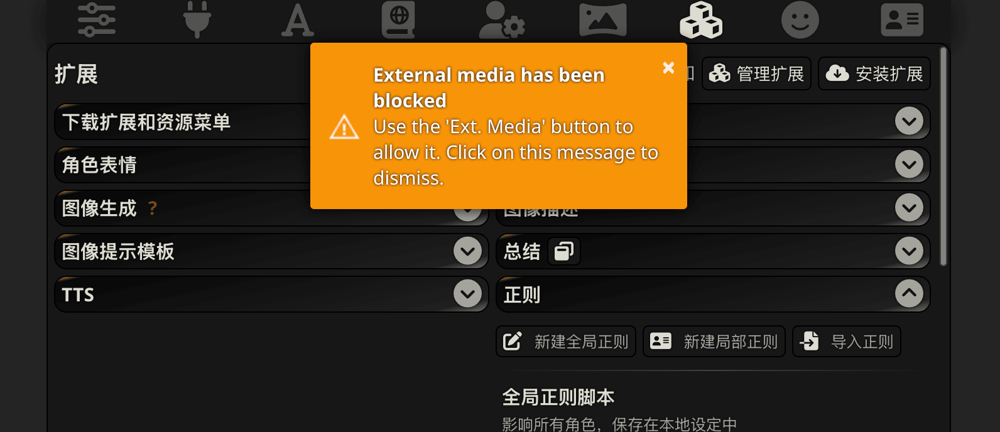
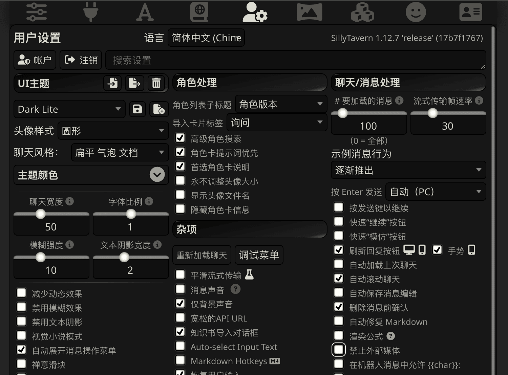
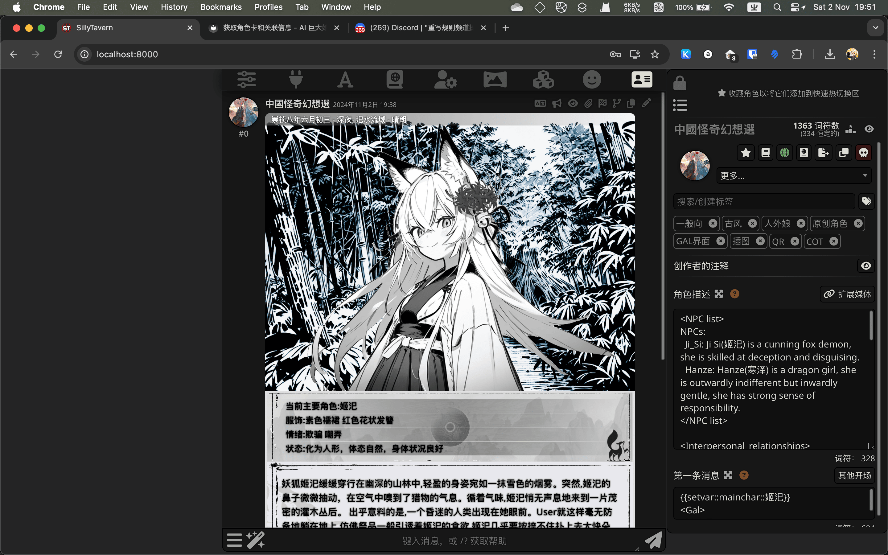

# 取得角色

角色是您可以创建和管理的 AI 身份，用于塑造 AI 在对话中的角色。每个角色都有名字、个性和对话历史。您可以创建任意数量的角色，并随时在它们之间切换。

角色可用于单独聊天，或将多个角色添加到群聊中以让他们相互互动。

!!! tips "关注姬老师喵"

    这部分教程中示例的角色卡来自 https://rentry.org/Himekaidou_Hatate ，
    关注姬老师谢谢喵。

技术上，角色卡就是包含一堆要发给 AI 的信息的一组数据，但是为了好看，一般会有一张图片做封面。
于是你可以直接下载作者在发布页面上的图片文件即可。

## 下载角色卡图片

!!! important "记得尽可能的下载原始图片"

    各种软件可能会为了节省空间等目的显示压缩后的图片，而压缩过程中可能会破坏元数据中储存的角色卡信息。

    因此请一律选择下载原图。

## 导入角色

点击酒馆菜单上的角色管理图标（最后一个），然后选择“从文件导入角色”，然后上传下载到的文件。

!!! tips 

    在电脑上，你也可以通过直接把下载好的角色卡图拖动到 SillyTavern 的窗口里达到一样的效果。

对于角色信息中含有标签的角色，可以在这一步选择是否添加相应的标签。

导入完成的角色就会显示在角色列表里了，点击角色即可进入聊天界面。

## 导入角色的关联数据

如果角色卡定义中有包含世界书，接下来便会提示你导入和关联。

导入完成之后会自动打开角色关联的世界书，点击世界信息按钮即可关闭。
 
!!! tips 

    如果你错过了在导入角色卡时导入角色关联的世界书这一步，稍后你可以在角色的更多选项里，
    选择 “导入角色卡的世界书”。

    

大多数角色卡会使用一种叫做正则表达式的文本替换机制来进行一些操作，例如删除思维链（CoT）的内容，
或是提供一些美化的界面。

在扩展菜单中，转到正则选项，点击局部正则脚本的开关以允许使用局部正则表达式。

!!! info "早期版本的行为可能与此不同"

    在旧版本中（<1.12.5），导入带有局部正则的角色卡时会像导入世界书时提示是否启用。

!!! important "如何使用角色卡中的外部媒体（插图，样式表等）"

    

    对于很多有外部插图的角色卡，开启局部正则后会提示你外部媒体目前被禁用。

    

    这个时候要前往用户设置，取消选择“禁止外部媒体”选项。

!!! important "部分角色卡可能要求手动导入更多关联数据"

    部分角色卡可能要求手动导入更多关联数据，例如快速回复脚本、额外的知识书等等。

    [或取其它周边信息](get_resource.md)一节中介绍了如何导入它们。