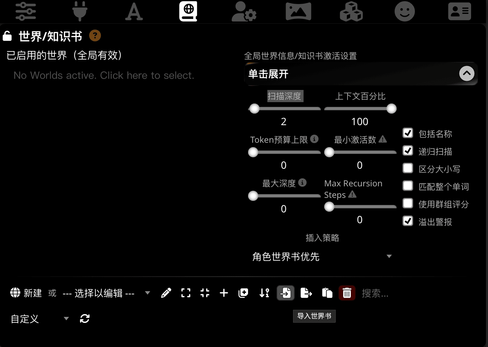
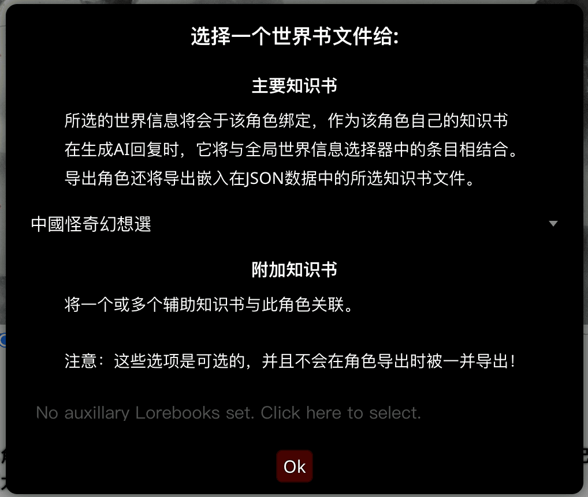
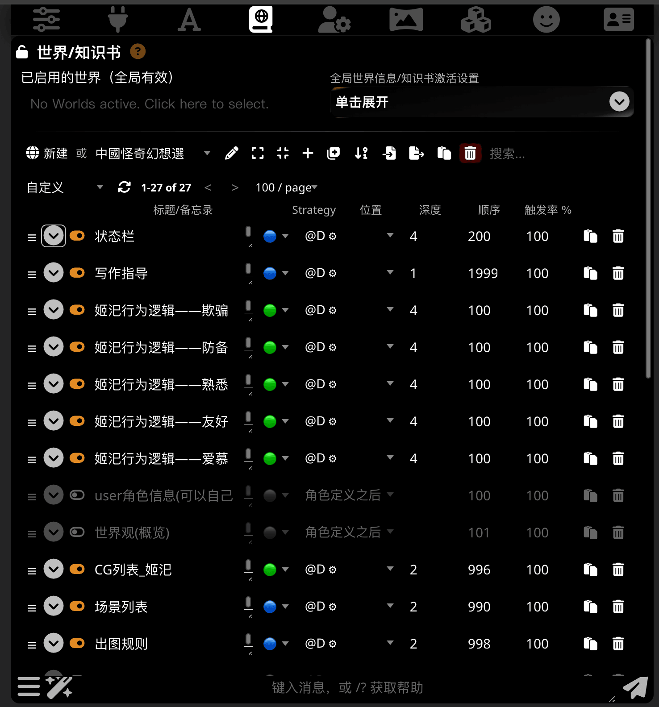
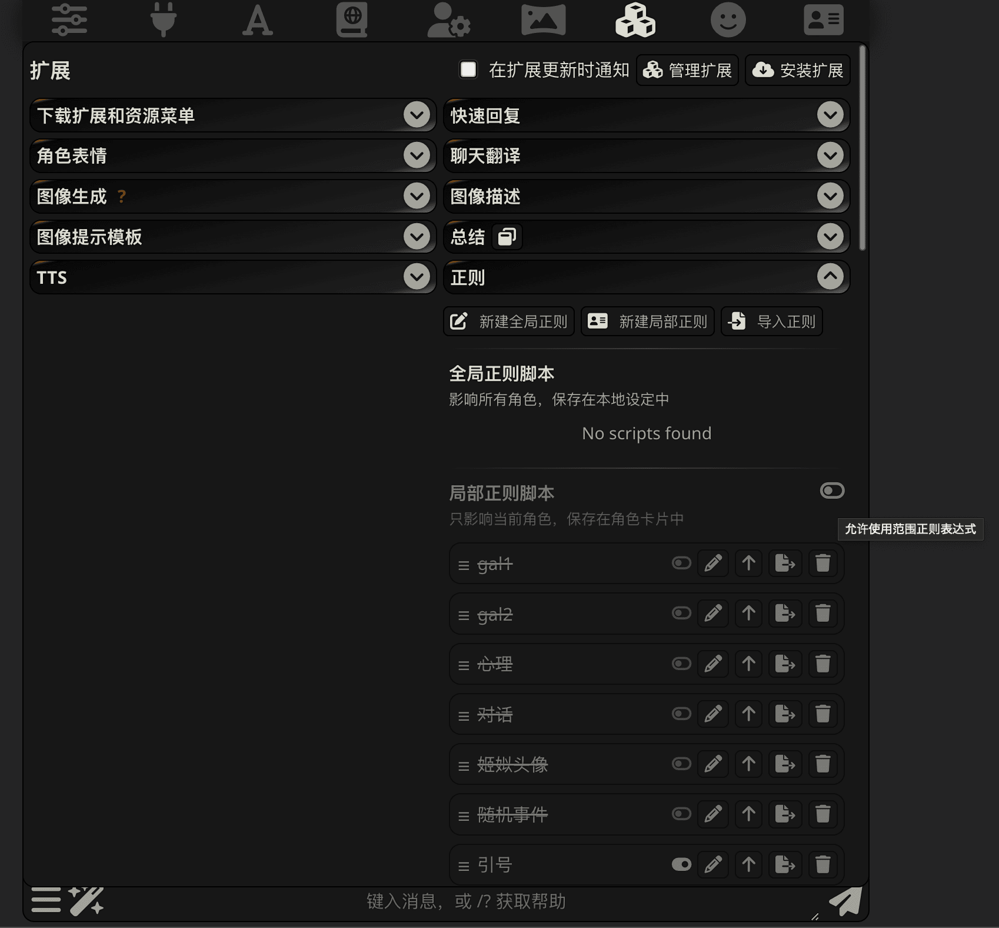
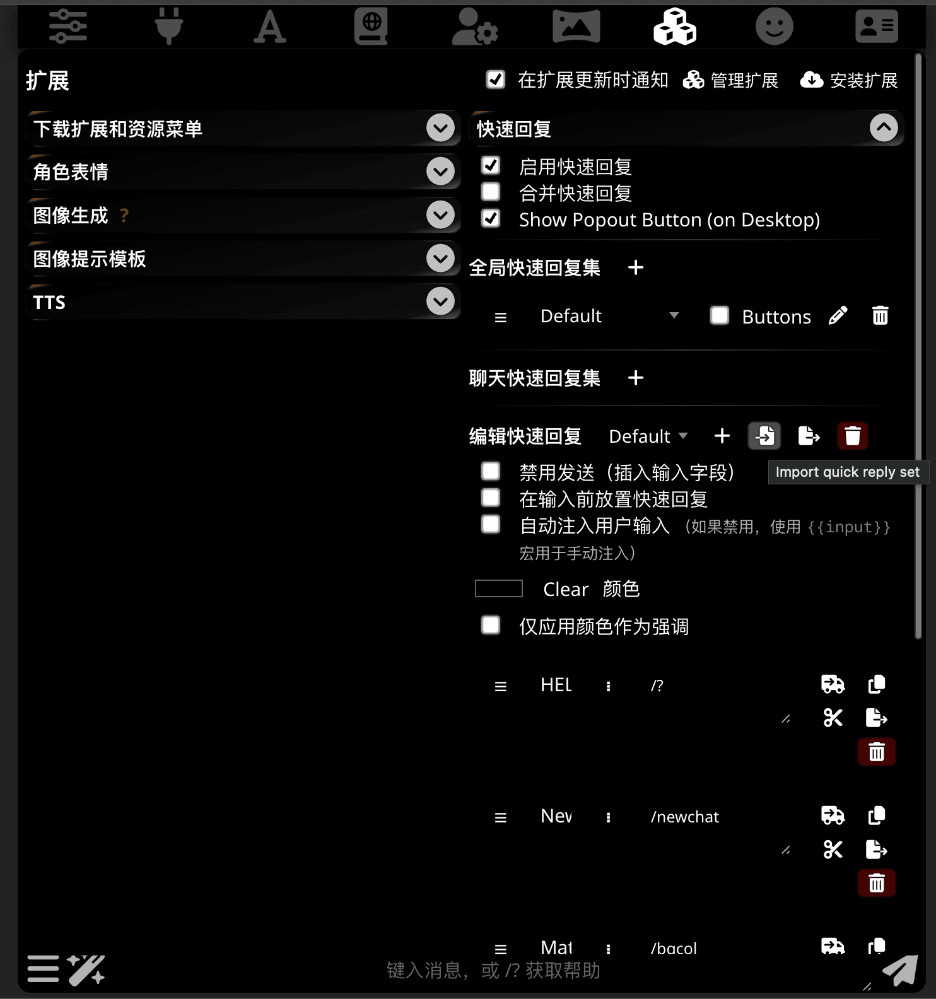
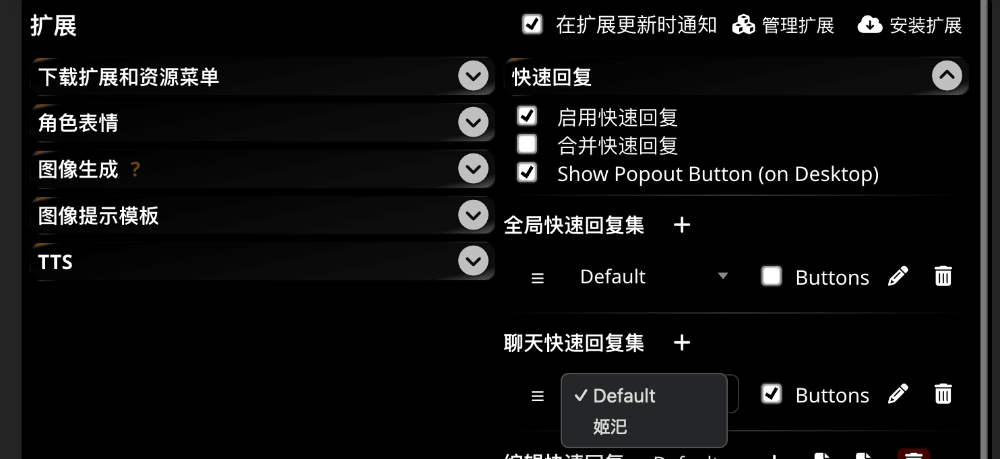
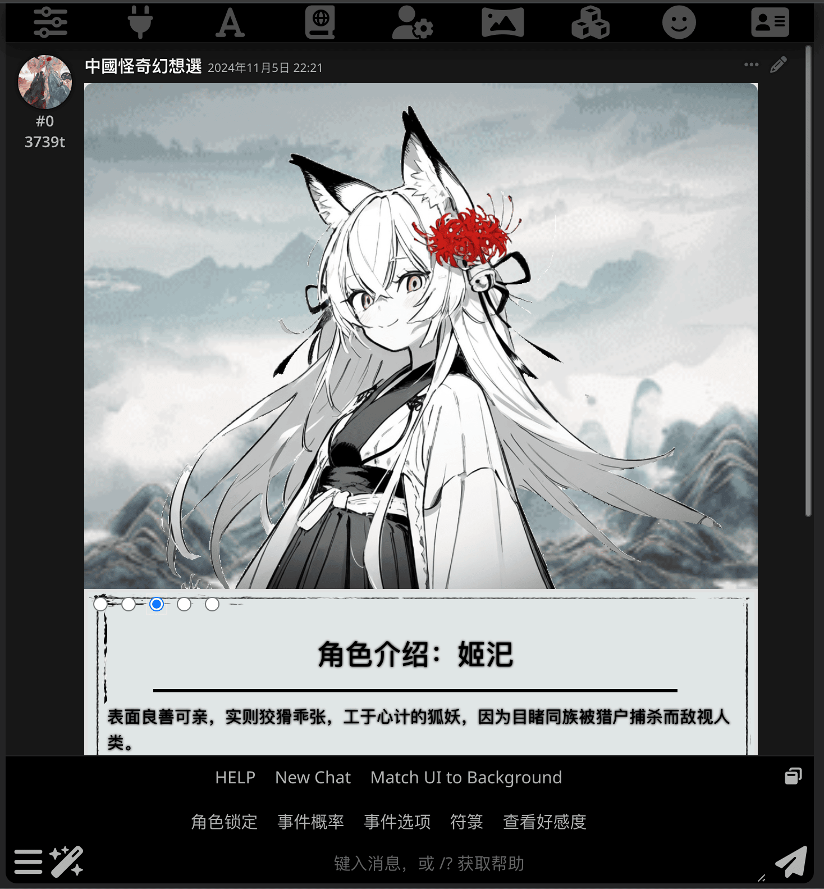

# 取得其它周边资源

## 世界书

!!! info "世界书是什么？" 

    世界书（也称为 Lore Books 或记忆书）是 ST 中强大的工具，可在聊天中动态插入提示以帮助引导 AI 回复。

    通常，世界信息（简称 WI）用于增强 AI 对虚构世界中的细节的理解，但是您可以使用世界信息条目来插入您想要插入提示中的任何内容。

    它的功能类似于一本动态词典，仅当消息文本中存在与条目相关的关键字时，才会插入来自世界信息条目的相关信息。

    SillyTavern 引擎激活并将适当的传说无缝集成到提示中，为 AI 提供背景信息。

    值得注意的是，虽然 World Info 有助于引导 AI 找到所需内容，但它并不能保证其出现在生成的输出消息中。这取决于您的模型利用附加信息的能力！

    -- [World Info | docs.ST.app ](https://docs.sillytavern.app/usage/worldinfo/)

### 调整世界信息/知识书激活设置

!!! info "特例优先"

    这里提供的设置供参考，如果你获取的角色卡建议的设置和这里不同，听作者的。

点击从左至右第四个按钮（世界信息）来打开世界信息管理，然后点击”全局世界信息/知识书激活设置“
下方的”点击展开“展开设置。

上图中的参数就是推荐的设置了，但如果你想进一步了解这些选项的作用的话……

??? tips "那些选项都有什么作用？"

    !!! info "扫描深度"
    
        定义应在聊天历史记录中扫描多少条消息来获取激活世界书条目的关键字。

        * 如果设置为 0，则只扫描世界书条目本身和作者注释。
        * 如果设置为 1，那么 Sillytavern 只扫描最后一条消息。
        * 2 = 最后两条消息，等等。
  
    !!! warning "扫描深度不是越多越好"

        过高的扫描深度会导致在发送消息之前需要处理的时间延长，同一时间内激活的世界书条目过多也有可能分散 AI 的注意力。

    !!! info "上下文百分比和 Token 预算"

        定义世界书条目使用的 Token 上限。
        可以定义相对于 API 的最大上下文设置的阈值（上下文百分比，100%即世界书条目可以使用全部的上下文长度）或直接指定 Token 上限（预算，0为禁用）。

        * 超过预算上限的条目将不会作为提示发送给模型。
        * 常量条目将首先插入。然后是具有更高顺序号的条目。
        * 通过直接提及其键插入的条目比在其他条目内容中提及的条目具有更高的优先级。

    !!! info "最小激活次数和最大深度"

        最小激活次数如果设置为非零值，则将忽略“扫描深度”的限制，从最新消息开始向后搜索所有聊天记录中的关键字，直到触发了最小激活次数中指定的条目。这仍将受到最大深度设置或总体预算上限的限制。

    !!! warning "最小激活次数与最大递归步数互斥"

        一旦设置了最大递归步数，则最小激活次数就不起作用。

    !!! info "最大递归步数"

        当设置为零时，递归嵌套仅受提示预算的限制。当设置为非零值时，将扫描总数限制为所需的最大“嵌套级别”。

        例如： 

            * 设置为 1 实际相当于禁用了递归，因为检查在第一步之后就停止了。
            * 设置为 2 表示只能激活一次递归条目，设置为 3 可以触发两次递归......

    !!! info "区分大小写"

        启用则表示为了进入上下文，输入键需要与“世界信息”条目中定义的大小写相匹配。

        例如，启用此选项之后， "Foo" 会激活关键字为 "Foo" 的条目，而不会激活关键字为 "foo" 的条目。

    !!! info "包括名称" 

        定义是否应将聊天参与者的姓名作为消息前缀包含在扫描文本缓冲区中。这允许激活使用姓名作为关键字的条目，而无需在消息中直接提及姓名。

    !!! info "匹配整个单词"

        仅当搜索文本中存在整个单词时，键仅包含一个单词的条目才会被匹配。默认情况下启用。

        比如开启该设置，输入键为 "King”，那么"long live the king"之类的文字就会被匹配，但是 "it's not to my liking" 就不会被匹配。

        此设置对不使用空格分隔单词的语言（例如日语或中文）使用时可能会产生不利影响。所以在大多数时候，这个选项都应该是关闭的。

### 导入额外的世界书

你下载到的世界书也是 JSON 格式。
只要找和导入预设一样的导入按钮按下去，然后选择下载到的世界书就好。

### 为所有聊天启用世界书

点击”已启用的世界（全局有效）”下面的输入框，选择想要启用的世界书即可。

### 为角色启用额外的世界书

转到角色管理面板，选择更多菜单下面的 “导入角色的世界书” 按钮。

点击附加知识书下面的输入框，选择希望为角色启用的世界书。当然别忘了保存。

### 开启或关闭世界书条目

某些时候你也许想要（或者作者提醒你可以）启用或禁用某一世界书条目，例如世界书提供了一份用户角色设定但你想使用自己的人设的时候。

在世界信息界面中选择一个世界书之后，可以点击展开按钮（向下的箭头）旁边的开关切换世界书条目的启用或禁用状态。

## 正则表达式（简称 RE）

大多数角色卡会使用一种叫做正则表达式的文本替换机制来进行一些操作，例如删除思维链（CoT）的内容，
或是提供一些美化的界面。部分的预设可能也会使用正则表达式来隐藏或删除输出中的杂讯。

在扩展菜单中，转到正则选项，你就能看见导入正则的按钮了。

## 快速回复（简称 QR）

!!! important "快速回复的可用性和酒馆版本十分相关"

    STscript 仍在积极开发中，因此请使用最新版本的酒馆。

!!! warning "不要随意运行来源不名的快速回复脚本"

    能力越大，责任越大。执行脚本前请务必小心并检查脚本。

STscript 是一种简单但功能强大的脚本语言，可用于扩展 SillyTavern 的功能而无需进行大量编码，而快速回复则是内置的 SillyTavern 扩展，提供了一种存储和执行脚本的简单方法。

快速回复菜单位于扩展菜单内，依然是点击那个熟悉的导入按钮导入。

点击全局或聊天快速回复旁边的加号，就会新增一行，然后就可以通过旁边的下拉菜单启用你选择的快速回复脚本集合。

已经启用的快速回复会显示在输入框的上方，在电脑上你也可以通过右上角的按钮把快速回复放在侧边。

