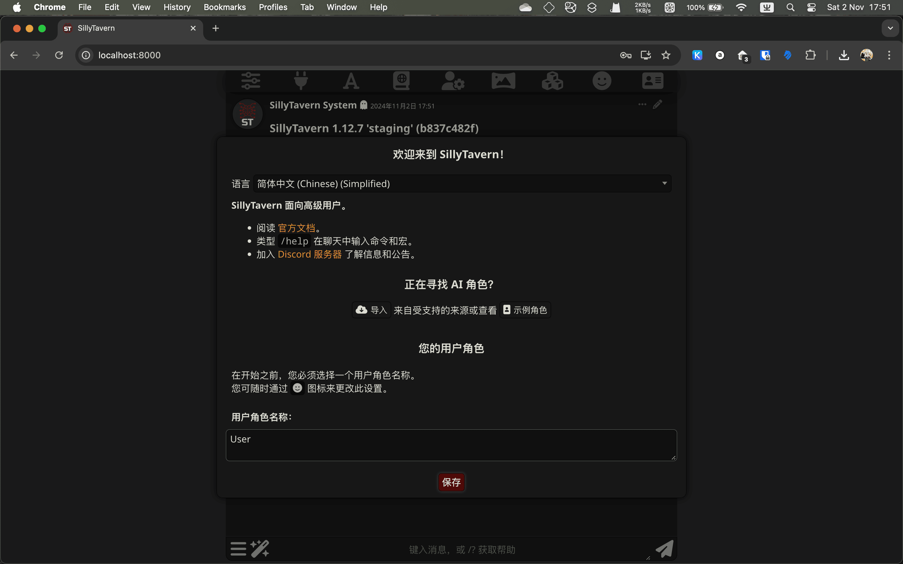
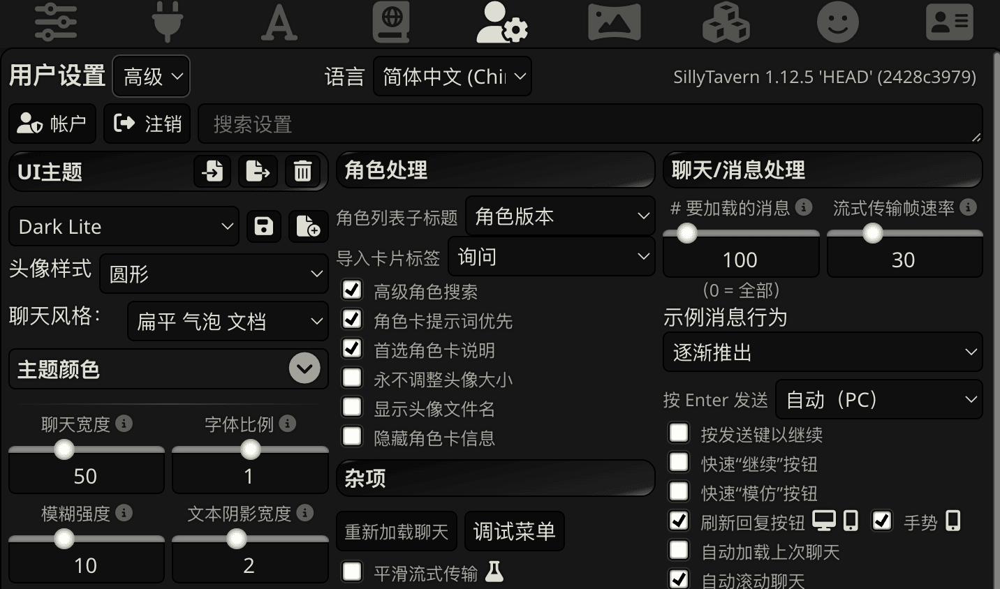

# 安装 SillyTavern

!!! info "SillyTavern-Launcher 是？"

    [SillyTavern-Launcher](https://github.com/SillyTavern/SillyTavern-Launcher) 是一组能够自动安装 SillyTavern 及其依赖，以及其它辅助功能的一些脚本。

    但介于文档作者没有用过，所以也不会涉及相关内容。

!!! failure "不推荐在没有任何准备的情况下在 VPS 等云服务上搭建 SillyTavern"

    4202 年了，浏览器都把不支持 HTTPS 的网站标记成不安全了。
    倘若你一意孤行的话，别有用心的人便有机会偷窥你的聊天记录，甚至偷走你的API密钥，让你产生大笔账单。

    但是不幸的是，几乎没有 CA 会为 IP 签发有效的证书，所以一个域名显然是必须的。我也不能建议你用自签名证书然后忽略证书问题。

    {--但假如你都有足够的智慧买到一个域名的话，你也应该有足够的智慧做到上面那些，于是我的话就真的成废话了。（x）--}

    因此，本文档不会涉及在云端搭建 SillyTavern 的方法。但假如你已经有了一个域名，可以参考[官方文档的相关部分](https://docs.sillytavern.app/usage/remoteconnections/)。

!!! important "开始之前"

    确保你要运行 SillyTavern 的环境中已经安装好了 Git 和 Node.js 。而且能够正常的连接到 GitHub 和 npmjs （或其镜像）。
    
    这部分文档不会再涉及如何安装它们，也不会解答形如“未找到命令”之类问题。

## 克隆 SillyTavern 仓库

```bash
$ git clone https://github.com/SillyTavern/SillyTavern.git
```

默认情况下，这步操作会克隆最新稳定版本的 release 分支。
既然这是默认情况，这就适合大多数人。

如果你出于某种迷之自信想要用开发中的 Staging 版本，或是某个旧版本的话，切换相应的分支和版本标签就成。

```bash
# 切换到 staging 分支
SillyTavern $ git checkout staging
# 切换到某个版本，例如 1.12.6
SillyTavern $ git checkout 1.12.6
# 切换回默认分支
SillyTavern $ git checkout release
```
## 安装依赖

```bash
# install 后面的参数分别表示：
# --no-audit: 隐藏 npm audit 的报告依赖可能存在漏洞的输出。
# --no-fund: 隐藏 npm fund 提醒部分模块正在寻求维护者或资金支持的提示。
# --loglevel=error: 在输出中隐藏大多数不是错误的输出。
# --no-progress: 不在运行过程中显示进度条。
# --omit=dev: 忽略只在开发过程中才需要的依赖。
SillyTavern $ npm install --no-audit --no-fund --loglevel=error --no-progress --omit=dev
```

```bash title="这是输出"
> sillytavern@1.12.7 postinstall
> node post-install.js


up to date in 899ms
```

在每次更新酒馆后，你最好也更新一下依赖（再次运行上面的命令）以避免可能会发生的意外情况。

## 启动

!!! tips

    在 Windows 上，你也可以通过双击 `SillyTavern` 目录中的 `start.bat` 来运行。

```bash
# 这两个命令的效果几乎是一样的。区别就是下面的命令会帮你运行上一步。
SillyTavern $ node server.js
# Termux
SillyTavern $ ./start.sh
# Windows 终端（PowerShell）
SillyTavern $ .\start.bat
```

```text title="这是输出"
Node version: v22.9.0. Running in undefined environment. Server directory: /Users/Foo/repo/SillyTavern
Preferring IPv4 for DNS resolution
Using data root: ./data


SillyTavern 1.12.7
Running 'staging' (b837c482f) - 2024-11-01 20:17:29 +0200

<i> [webpack-dev-middleware] wait until bundle finished
webpack 5.95.0 compiled successfully in 5750 ms
Launching...
SillyTavern is listening on IPv4: 127.0.0.1:8000

=================================================

Go to: http://127.0.0.1:8000/ to open SillyTavern

=================================================
```

接下来，在浏览器中打开 http://127.0.0.1:8000/ 或你的输出中显示的地址，即可打开 SillyTavern 的界面。



SillyTavern 会根据浏览器所使用的语言自动选择界面的语言。

!!! note "(1.12.5及以前版本) 确保用户设置是”高级“模式"

    某些操作（例如导入聊天预设）需要在”高级“模式下进行，如果你找不到导入按钮，你可能需要修改用户界面模式。
    
    点击”用户设置“按钮（第五个）可以打开用户设置窗口，简单和高级模式的区别如下。

    

    

    \1.12.6 版本开始删除了简单模式，因此不需要这么做了。