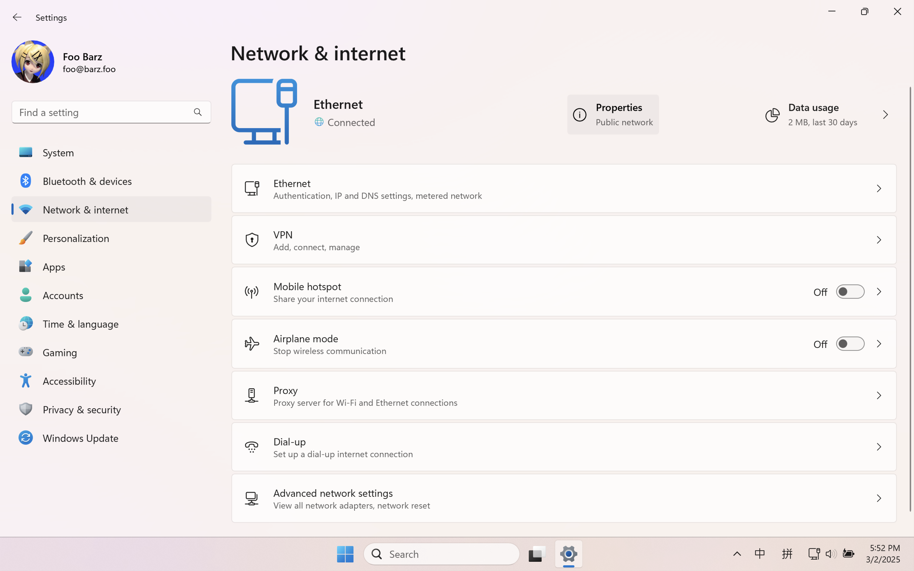
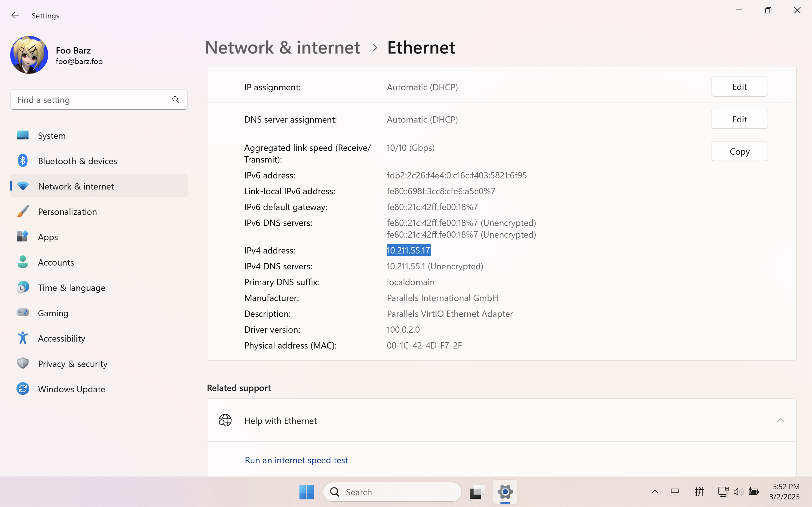
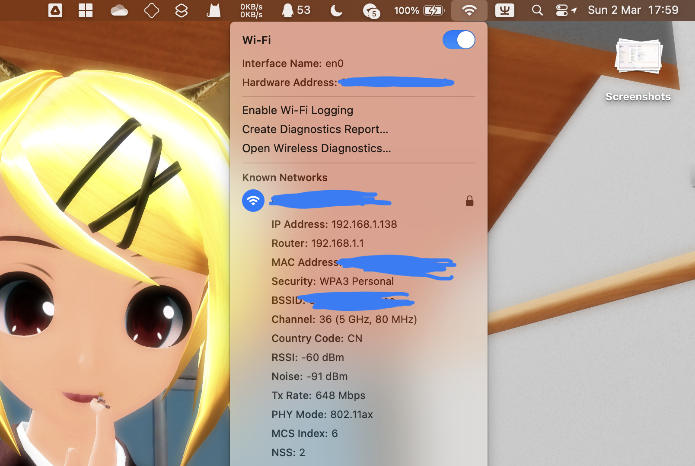
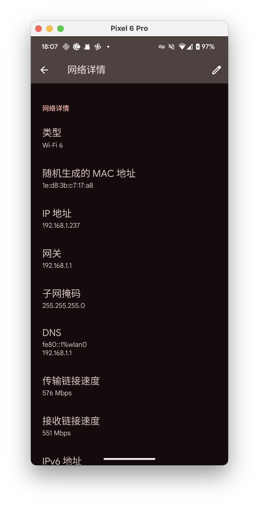
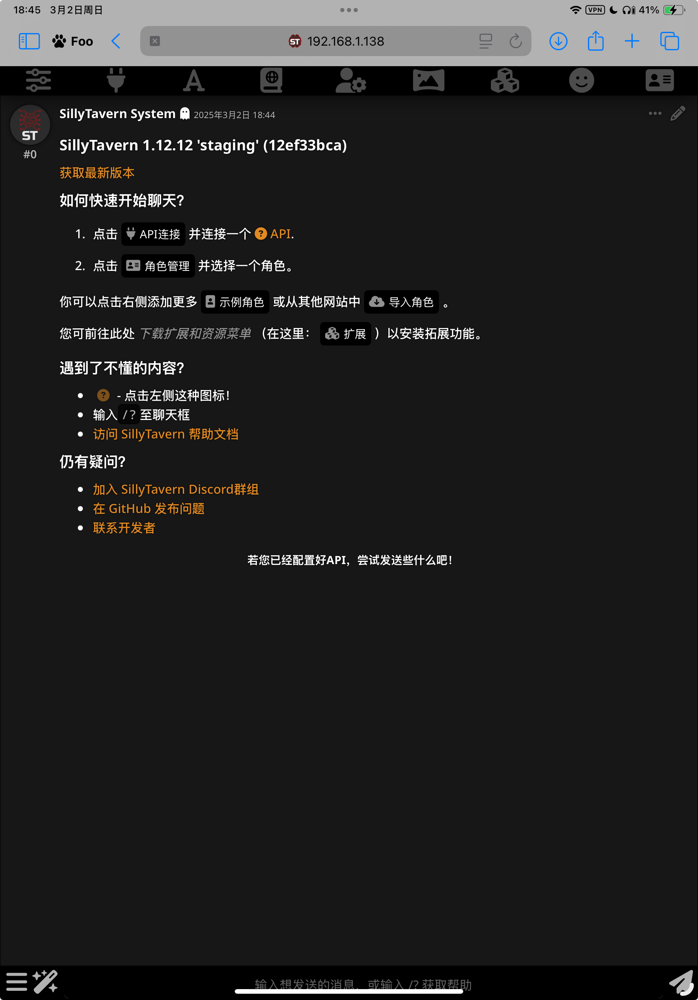

# 在局域网中共享同一个 SillyTavern 安装实例

在某些时候会很有用，例如你只有 iPhone （x），或是不想在手机和电脑上分别开一个。

!!! warning "务必知晓什么是局域网"

    简而言之，这篇文档不会介绍跨过一个局域网段访问的问题。例如在办公室连接家中的酒馆这样的。

    因为涉及的问题更多了 🙃

## 确定需要共享酒馆的设备在局域网中的 IP 地址

### Windows

依次打开 “设置” \> “网络和 Internet”，点击已连接到的网络旁边的”属性“。



在“IPv4 地址”那里就可以看到这台电脑的 IP 地址。




### macOS

按住 ++option++ 键的同时点击菜单栏上的 Wi-Fi 图标，就可以在 SSID 下方看到 IP 地址。



### Android

!!! info 

    文档自然不能涵盖所有定制 UI 的情况，仅举例在类原生界面（AOSP/Google Pixel 等）下的操作。

打开设置，转到"网络与互联网" \> "互联网" ，选择你连接到的 WLAN 网络，即可在下方的”网络详情“中看到 IP 地址。



## 让 SillyTavern 可以接受来自局域网的连接

!!! important "该编辑哪个 config.yaml ?" 

    如果直接在 SillyTavern 文件夹中搜索，你可能会找到两个 `config.yaml` 文件。

    本文档中对的所有修改均指 SillyTavern 根目录 (`/SillyTavern/config.yaml`) 中的修改，而不是默认配置文件(`/SillyTavern/default/config.yaml`)。

用你用起来最顺手的编辑器打开 SillyTavern 的配置文件（`config.yaml`），找到其中的 `listen` 字段，把它的值修改成 `true` ，
就像这样：

```yaml
listen: true
```

接下来启动 SillyTavern，你应该能在终端的日志中看到下列信息：

```text
SillyTavern is listening on IPv4: 0.0.0.0:8000

To limit connections to internal localhost only ([::1] or 127.0.0.1), change the setting in config.yaml to "listen: false".
Check the "access.log" file in the data directory to inspect incoming connections: data/access.log
```

!!! tips 

    如果你在 Windows 上第一次这样启动，别忘了同意 Windows 防火墙添加例外的弹出提示。

但你现在用局域网中的其它设备连接的时候，会显示一个错误消息，提示不在白名单内。

!!! failure "其中一种错误样式"

    Forbidden

    If you are the system administrator, add your IP address to the whitelist or disable whitelist mode by editing config.yaml in the root directory of your installation.

    Connection from xxx.xxx.xxx.xxx has been blocked. This attempt has been logged.

!!! failure "终端中错误输出的样例"

    Blocked connection from xxx.xxx.xxx.xxx ; User Agent: Mozilla/5.0 (Linux; Android 10; K) AppleWebKit/537.36 (KHTML, like Gecko) Chrome/131.0.0.0 Mobile Safari/537.36

	To allow this connection, add its IP address to the whitelist or disable whitelist mode by editing config.yaml in the root directory of your SillyTavern installation.

继续用你用起来最顺手的编辑器打开 SillyTavern 的配置文件（`config.yaml`），找到其中的 `whitelist` 字段，填写你希望加入白名单中的 IP 地址，一行一个，例如：

```yaml
whitelist:
  - 127.0.0.1
```

考虑到局域网内的 IP 地址有可能会发生变化，这里也支持基于通配符或 CIDR 记法的 IP 地址段。
例如下面的写法都接受 `192.168.0.1` 到 `192.168.255.254` 范围内的 IP 地址：

```yaml
whitelist:
  - 192.168.*.*
  - 192.168.0.0/8
```

编辑完白名单文件后，重启 SillyTavern。即可在其它同一局域网的设备上通过 `IP地址:端口号` 的方式访问局域网内的 SillyTavern 实例。



