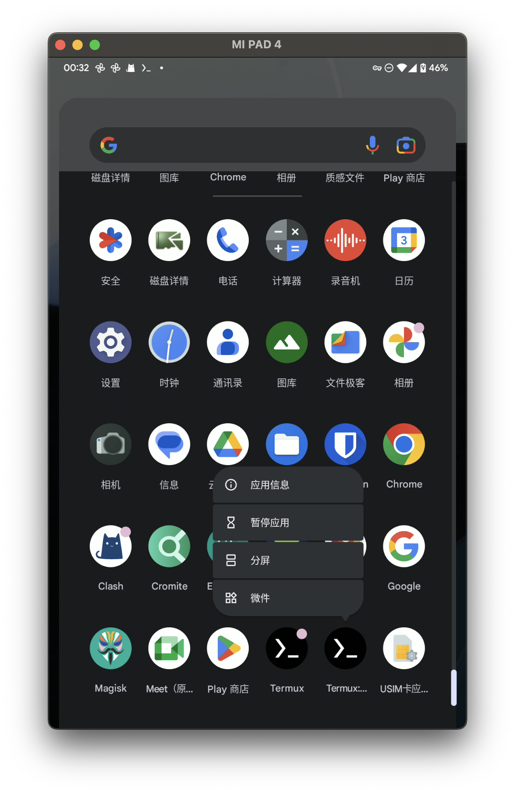
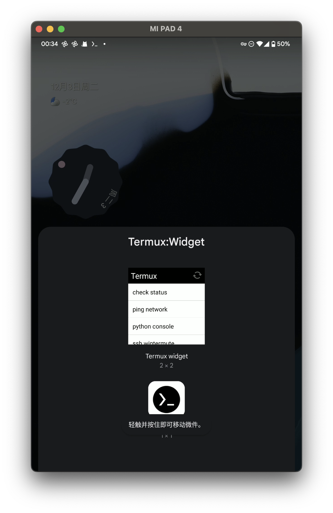
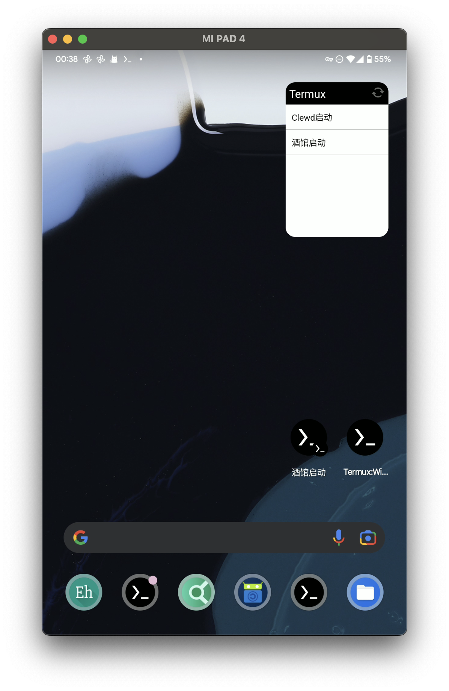

# 杂鱼用 SillyTavern 部署脚本 on Termux

在 Termux 上部署 SillyTavern 和 Clewd。

!!! info "杂鱼\~杂鱼\~"

    😈 承认你是看不懂手动安装教程或是懒狗杂鱼了？
    
## 系统需求

* 安装 Termux，以及 Termux:API 和 Termux:Widgets 插件。
* 拥有能够良好的连接到 Github 和/或 npmjs 的国际互联网连接。

## 运行步骤

* 在 Termux 上运行以下命令：

```bash
curl -O https://raw.githubusercontent.com/foobarz076/gtss_ai_docs/refs/heads/main/docs/chatting/sillytavern/termux_deployment_script/setup-termux.sh && chmod +x setup-termux.sh && ./setup-termux.sh
```

* 按提示运行脚本，直到看到下面两行：

```text
✅ 酒馆和 Clewd 安装完毕
👉 添加 Termux:Widget 小部件或快捷方式即可分别运行 clewd 和酒馆。
```

!!! info 

    除了下面的方式以外，你也可以通过 SillyTavern 和 Clewd
    安装教程中的命令手动启动 SillyTavern 和 Clewd。

* 添加 Termux:Widget 小组件或快捷方式。

!!! info 

    具体方式因你使用的桌面不同而异，这里以 Pixel 启动器为例。
    基于 AOSP 启动器（Launcher3）的其它桌面，例如 Lawnchair 的操作方式类似。



    * 按住 Termux:Widget 的图标，选择“微件”。



    * 将小组件或快捷方式拖放到桌面上。

